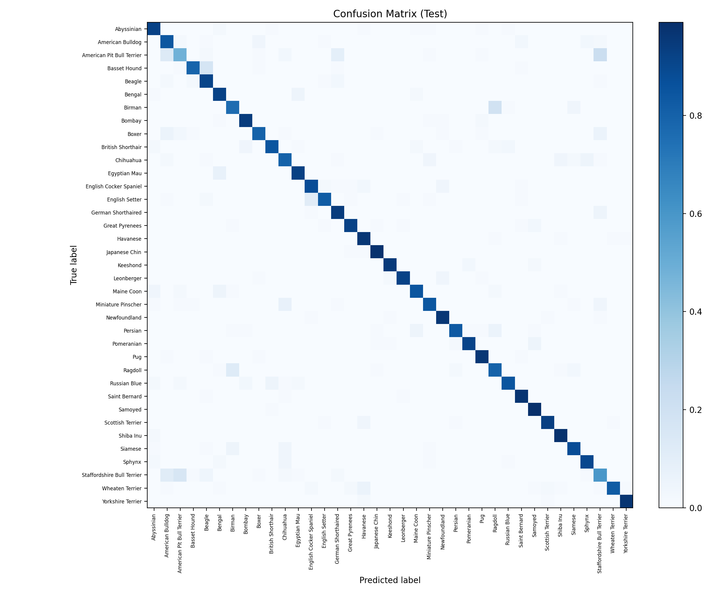
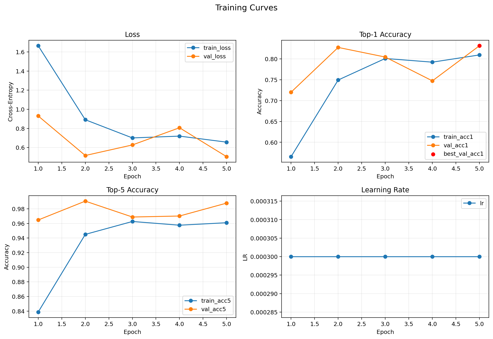

# PyTorch Pets Classifier
[](https://github.com/AlexBatrakov/pytorch-pets-classifier/actions/workflows/ci.yml)

Minimal, production-style baseline for multi-class image classification on the Oxford-IIIT Pets dataset (37 breeds). Uses transfer learning with torchvision ResNet18 ImageNet weights and runs on macOS MPS or CPU.

## Setup

```bash
python -m venv .venv
source .venv/bin/activate
pip install -r requirements.txt
```

Install development dependencies (tests):

```bash
pip install -r requirements-dev.txt
```

## Testing

```bash
python -m pytest -q
```

Test scope:
- Unit: config overrides, metrics math, device selection, best-checkpoint selection logic.
- Integration: metrics CSV write path and training-curves plotting from CSV.
- Smoke: imports and basic model/dataset construction.

Experiment logs:
- Main summary stays in this README.
- Detailed run notes go to `docs/experiments/README.md`.

## Train

```bash
python -m src.train --config configs/default.yaml
```

Run with cosine scheduler + early stopping preset:

```bash
python -m src.train --config configs/cosine_earlystop.yaml
```

Common overrides:

```bash
python -m src.train --epochs 10 --batch-size 64 --lr 3e-4 --freeze-epochs 2 --num-workers 0
```

Best checkpoint is saved to `./checkpoints/best.pt`.
Per-epoch metrics are saved to `./artifacts/metrics.csv`.
Each checkpoint also stores run metadata (`git_commit`, `created_at_utc`, `device`, `torch_version`, parameter counts, and epoch metrics).

Example `metrics.csv`:

```csv
epoch,train_loss,train_acc1,train_acc5,val_loss,val_acc1,val_acc5,lr
1,1.665000,0.566000,0.839000,0.930600,0.720000,0.965000,0.00030000
2,0.890800,0.749000,0.945000,0.516700,0.827000,0.990000,0.00030000
```

Build training curves from the metrics file:

```bash
python -m src.plot_metrics --metrics artifacts/metrics.csv --out assets/training_curves.png
```

## Evaluate

```bash
python -m src.eval --ckpt checkpoints/best.pt --split val
```

Evaluate on the official test split:

```bash
python -m src.eval --ckpt checkpoints/best.pt --split test
```

Save a confusion matrix image:

```bash
python -m src.eval --ckpt checkpoints/best.pt --split test --cm-out assets/confusion_matrix.png --cm-normalize
```

## Results

### Baseline experiment

Training command used for the baseline below:

```bash
python -m src.train --config configs/default.yaml --epochs 15
```

| Parameter | Value |
| --- | --- |
| Model | ResNet18 (ImageNet pretrained) |
| Dataset | Oxford-IIIT Pets (37 classes) |
| Epochs | 15 (best checkpoint at epoch 7 by val acc@1) |
| Batch size | 32 |
| Optimizer | AdamW |
| Learning rate | 3e-4 |
| Scheduler | none |

### Final metrics (best checkpoint)

| Split | loss | acc@1 | acc@5 |
| --- | --- | --- | --- |
| Val | 0.4513 | 0.863 | 0.986 |
| Test | 0.5881 | 0.817 | 0.974 |




### Observations

- Validation top-1 peaks at epoch 7, then does not improve meaningfully.
- Around epochs 10-12+, val loss trends worse while train accuracy keeps increasing, indicating overfitting.
- Top-5 stays high, so most errors are near-misses between visually similar breeds.

## Predict

```bash
python -m src.predict --ckpt checkpoints/best.pt --image path/to/image.jpg
```

Example output:

```
Top-1: abyssinian (0.9234)
Top-5:
	abyssinian (0.9234)
	bengal (0.0345)
	siamese (0.0121)
	ragdoll (0.0098)
	birman (0.0076)
```

## macOS MPS

The code automatically selects MPS if available via `torch.backends.mps.is_available()`. If MPS is not available, it falls back to CPU.

## Repo hygiene

- Dataset downloads to ./data (not committed)
- Checkpoints saved to ./checkpoints (not committed)

## Roadmap

- Grad-CAM visualization
- AMP training
- Optuna hyperparameter search
- Weights & Biases logging
- ONNX export
