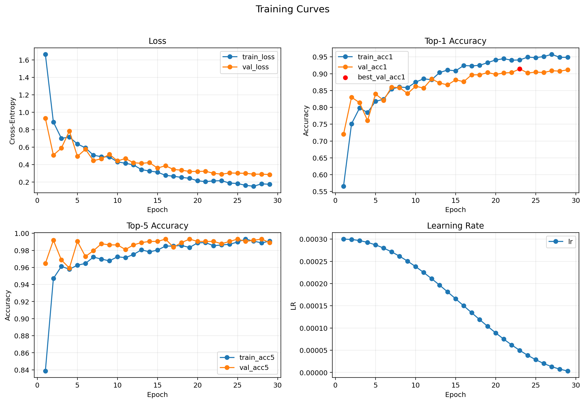
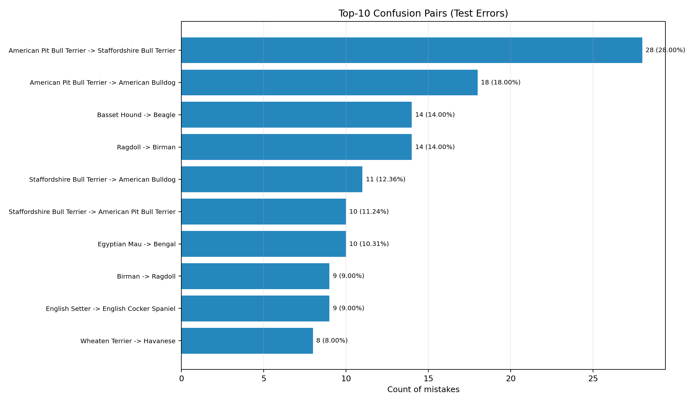

# PyTorch Pets Classifier
[](https://github.com/AlexBatrakov/pytorch-pets-classifier/actions/workflows/ci.yml)
[](https://github.com/AlexBatrakov/pytorch-pets-classifier/actions/workflows/deploy.yml)
[](LICENSE)
[](https://www.python.org/)
[](https://pytorch.org/)
[](https://petsdsdemo-api.salmondune-59471bd6.germanywestcentral.azurecontainerapps.io/health)

Showcase **Data Science / ML** pet project for fine-grained image classification on **Oxford-IIIT Pets (37 breeds)** using **PyTorch + torchvision (ResNet18 transfer learning)**.

The goal of this repo is not only to train a model, but to demonstrate an evidence-based DS workflow:
- a clean PyTorch training/evaluation pipeline,
- experiment design, tracking, and comparison,
- robust model selection (seed sweeps, not only single-seed peaks),
- structured error analysis with plots, visual examples, and hypotheses,
- tests + CI for core pipeline behavior,
- a minimal model-serving path from checkpoint to public cloud endpoint,
- a release-oriented GitHub Actions delivery workflow to Azure.

## At A Glance (For Recruiters / Reviewers)

What this project demonstrates:
- **Applied ML experimentation discipline**: controlled ablations, seed sweeps, explicit model-selection rules
- **Evidence-based iteration**: error analysis -> hypothesis -> screening -> robustness follow-up
- **Reproducibility + engineering hygiene**: isolated runs, experiment docs, tests + CI
- **ML delivery basics**: shared inference core -> FastAPI -> Docker -> Azure Container Apps
- **Release-oriented CD**: GitHub Actions -> ACR -> Azure Container Apps with post-deploy smoke checks
- **Honest reporting**: documented negative results (for example rejected `ColorJitter` recipe), not only wins

Fastest way to review the project (2-3 minutes):
- [Experiment index + comparison table](docs/experiments/README.md)
- [Current showcase experiment (`exp17`)](docs/experiments/exp17_cosine_es_img256_wd1e3_s42.md)
- [3-seed robustness summary for current showcase recipe](docs/experiments/seed_sweep_img256_wd1e3.md)
- [Error analysis for current showcase model (`exp17`)](docs/experiments/error_analysis_exp17.md)
- [Group A-short improvement cycle summary](docs/experiments/group_a_short_resolution_wd_aug.md)
- [Cloud-minimum deployment notes](#cloud-minimum-deployment)

## Cloud-Minimum Deployment

This repo now includes a minimal deployment path for the showcase model:

- shared inference core in `src/inference.py`
- HTTP API in `src/api.py`
- Docker image for local reproducibility
- public deployment in Azure Container Apps

Live demo:
- API URL: `https://petsdsdemo-api.salmondune-59471bd6.germanywestcentral.azurecontainerapps.io`
- `GET /health`
- `POST /predict`

Important scope note:
- this is a **minimal deployment showcase**, not a full MLOps platform
- there is no training orchestration, model registry, or auth layer in this phase

## CI And Release-Oriented Delivery

This repo now has both:

- `CI`: automated test workflow in `.github/workflows/ci.yml`
- `CD`: release-oriented deploy workflow in `.github/workflows/deploy.yml`

Current delivery shape:

- trigger policy:
  - manual `workflow_dispatch`
- GitHub environment:
  - `production`
- Azure auth:
  - OIDC via `azure/login`
- serving artifact source:
  - pinned GitHub Release asset from `v1.1.0`
- deploy target:
  - existing Azure Container App

What the deploy workflow does:

- reads `deploy/showcase_model.json`
- downloads the pinned showcase checkpoint
- verifies checksum
- builds a Linux Docker image
- pushes the image to ACR
- updates Azure Container Apps
- runs post-deploy `/health` and `/predict` smoke checks

Important scope note:

- this is **Continuous Delivery**, not auto-deploy on every push
- it is a small release-oriented delivery path, not a full CI/CD platform

## Results Snapshot

### Final showcase model
- **Chosen model:** `exp17_cosine_es_img256_wd1e3_s42` (ResNet18 + cosine + early stopping + `img256` + `wd=1e-3`)
- **Why this one:** won a controlled Group A-short screening (resolution + `weight_decay`) and then improved the **3-seed mean ± std** versus the previous showcase recipe

### Metrics (best checkpoint)

| Split | loss | acc@1 | acc@5 |
| --- | --- | --- | --- |
| Val | 0.2918 | 0.925 | 0.992 |
| Test | 0.4292 | 0.881 | 0.985 |

### Robustness (seeds `42/123/777`) for showcase setup

| Metric | Mean ± std |
| --- | --- |
| test_acc1 | `0.8829 ± 0.0015` |
| test_acc5 | `0.9854 ± 0.0014` |
| test_loss | `0.4159 ± 0.0158` |

### Key takeaways
- A controlled Group A-short cycle (resolution -> `weight_decay` -> one augmentation test) improved the showcase recipe **without changing the backbone**.
- `img256 + wd=1e-3` improved both mean `test_acc1` and run-to-run stability vs the previous cosine showcase setup.
- A mild `ColorJitter` test was a useful negative result (it hurt accuracy), which helped avoid blind augmentation tuning.
- Error analysis still indicates the main weakness is **fine-grained breed separation**, not complete feature failure.

### Why this is a strong portfolio result (not just a score)
- The final recipe was selected by **robustness (`mean ± std`)**, not a cherry-picked single run.
- Improvements were tested **one axis at a time** (resolution -> `weight_decay` -> one augmentation).
- The repo preserves the full reasoning trail: experiment table, seed sweeps, error analysis, and negative-result documentation.

### Showcase visuals




## Model Selection (Robustness-First)

Selection rules used in this project:
- **Within one run:** save `best.pt` by highest `val_acc1` (early stopping also monitors `val_acc1`)
- **Across configs:** compare candidates on the same train/val/test split and log results in `docs/experiments/README.md`
- **Do not trust single-seed peaks:** rerun close contenders with seeds `42/123/777`
- **Prefer robustness over cherry-picking:** compare `mean ± std`, not only the best number
- **Use test metrics transparently:** reported for comparison and final justification

Final decision:
- `exp07` (`batch=16`) achieved a strong **single-seed** result, but was less stable across seeds
- Group A-short then tested a controlled set of low-risk recipe changes on `ResNet18`:
  - resolution sweep (`224/256/320`)
  - `weight_decay` sweep on the best resolution
  - one augmentation recipe (`ColorJitter`, rejected)
- `exp17` (`img256 + wd=1e-3`) became the best screening candidate and was confirmed on seeds `42/123/777`
- the `exp17` recipe improved mean `test_acc1` and reduced variance vs the previous `exp02` showcase recipe
- therefore the `exp17` recipe is the current showcase model

Details:
- Experiment index: [docs/experiments/README.md](docs/experiments/README.md)
- Group A-short screening summary: [docs/experiments/group_a_short_resolution_wd_aug.md](docs/experiments/group_a_short_resolution_wd_aug.md)
- Current showcase seed sweep (`exp17` recipe): [docs/experiments/seed_sweep_img256_wd1e3.md](docs/experiments/seed_sweep_img256_wd1e3.md)
- Previous cosine winner seed sweep (`exp02` recipe): [docs/experiments/seed_sweep_cosine.md](docs/experiments/seed_sweep_cosine.md)
- Small-batch seed sweep (`exp07`): [docs/experiments/seed_sweep_cosine_bs16.md](docs/experiments/seed_sweep_cosine_bs16.md)

## Error Analysis (Showcase Model `exp17`)

Detailed report:
- [docs/experiments/error_analysis_exp17.md](docs/experiments/error_analysis_exp17.md)

Key findings from the `test` split:
- Errors are still concentrated in visually similar breeds (`American Pit Bull Terrier`, `Staffordshire Bull Terrier`, `Ragdoll`, `Basset Hound`, `Birman`)
- `436` top-1 errors were made, but `381` (`87.4%`) still contain the true class in top-5
- Overconfident mistakes still exist, but their frequency decreased vs `exp02` (for example `>= 0.90` confidence errors: `17.9%` vs `20.4%`)
- Main weakness remains fine-grained class ranking/separation, especially in a few hard breed clusters

Historical reference:
- Previous showcase error analysis (`exp02`): [docs/experiments/error_analysis_exp02.md](docs/experiments/error_analysis_exp02.md)


## Next Steps (Planned, Optional Reading)

Priority sequence after the current showcase update:

- **MLflow or W&B as a thin tracking layer**  
  Add industry-familiar experiment logging on top of the existing YAML/config/artifact workflow without rewriting the training pipeline.

- **Calibration / uncertainty analysis (Group C)**  
  Add a reliability diagram + temperature scaling for `exp17` to strengthen the trustworthiness story.

- **Short error-delta write-up (`exp17` vs `exp02`)**  
  Summarize where the new recipe improved (and regressed) by class/confusion pair.

- **One controlled backbone upgrade (Group B)**  
  Compare `ResNet18` vs `ResNet34/ResNet50` under the same evaluation protocol and seed-based validation.

## Quickstart

### Setup

Repo runtime baseline: **Python 3.13**

```bash
python -m venv .venv
source .venv/bin/activate
pip install -r requirements.txt
```

Development dependencies (tests):

```bash
pip install -r requirements-dev.txt
```

Optional convenience layer:

```bash
make help
make doctor
```

Optional API env vars:

```bash
set -a
source .env.example
set +a
```

### Checkpoint conventions

- `./checkpoints/best.pt` is only a local convenience path.
- The current **showcase source-of-truth** checkpoint is `runs/exp17_cosine_es_img256_wd1e3_s42/checkpoints/best.pt`.
- Training artifacts are not committed to git, so a fresh clone will not contain the showcase weights until you reproduce the run locally.
- The public Azure demo is the fastest way to review the deployed model without reproducing training first.

### Train (baseline)

```bash
python -m src.train --config configs/default.yaml
```

### Train (cosine + early stopping preset)

```bash
python -m src.train --config configs/cosine_earlystop.yaml
```

### Evaluate

```bash
python -m src.eval --ckpt path/to/checkpoint.pt --split val
python -m src.eval --ckpt path/to/checkpoint.pt --split test
```

Save confusion matrix:

```bash
python -m src.eval --ckpt path/to/checkpoint.pt --split test --cm-out assets/confusion_matrix.png --cm-normalize
```

### Predict one image

```bash
python -m src.predict --ckpt path/to/checkpoint.pt --image path/to/image.jpg
```

Makefile shortcut:

```bash
make predict
```

Notes:
- if `IMAGE_PATH` is not set, `make predict` auto-creates a small deterministic smoke-test image
- if you want a real file instead, use `make predict IMAGE_PATH=path/to/image.jpg`

### Local HTTP API

The local API expects a checkpoint on disk. For the showcase path, either:
- reproduce `exp17` first (see below), or
- point `MODEL_PATH` at another compatible checkpoint

Run the service:

```bash
export MODEL_PATH=runs/exp17_cosine_es_img256_wd1e3_s42/checkpoints/best.pt
export MODEL_VERSION=exp17_cosine_es_img256_wd1e3_s42
export DEVICE=cpu
python -m src.api
```

Makefile shortcut:

```bash
make serve
```

Note:
- `make serve` runs the API in the foreground, so use a second terminal for `make health-local` or `make predict-local`

Health check:

```bash
curl http://127.0.0.1:8080/health
```

Prediction request:

```bash
curl -X POST "http://127.0.0.1:8080/predict?top_k=3" \
  -F "file=@path/to/image.jpg"
```

Response shape:

```json
{
  "label": "Boxer",
  "score": 0.1328,
  "top_k": [
    {"label": "Boxer", "score": 0.1328},
    {"label": "Abyssinian", "score": 0.0638},
    {"label": "Bengal", "score": 0.0545}
  ],
  "inference_ms": 63.7,
  "model_version": "exp17_cosine_es_img256_wd1e3_s42"
}
```

### Docker

The demo Docker image bakes in the showcase checkpoint from:
- `runs/exp17_cosine_es_img256_wd1e3_s42/checkpoints/best.pt`

That means a fresh clone needs the showcase artifact present locally before `docker build`.

Build and run locally:

```bash
docker build -t pytorch-pets-api:local .
docker run --rm -p 8080:8080 pytorch-pets-api:local
```

Check endpoints:

```bash
curl http://127.0.0.1:8080/health
curl -X POST "http://127.0.0.1:8080/predict?top_k=3" \
  -F "file=@path/to/image.jpg"
```

Apple Silicon note:
- local `docker build` is fine for local testing
- for Azure Container Apps, build the image as `linux/amd64`

### Azure Container Apps

Public deployment used:
- Azure Container Registry (ACR)
- Azure Container Apps (ACA)
- region: `germanywestcentral`

Why this path:
- it keeps the cloud scope minimal
- ACA supports external HTTP ingress and scale-to-zero style behavior
- Azure for Students subscription policies can restrict available regions, so pick an allowed region for your subscription

Working deployment flow:

```bash
export AZ_REGION=germanywestcentral
export AZ_RG=rg-petsdemo
export AZ_LOGS=log-petsdemo
export AZ_ENV=petsdemo-env
export AZ_ACR=<globally-unique-acr-name>
export AZ_APP=petsdemo-api

az login
az extension add --name containerapp --upgrade
az group create --name "$AZ_RG" --location "$AZ_REGION"
az monitor log-analytics workspace create \
  --resource-group "$AZ_RG" \
  --workspace-name "$AZ_LOGS" \
  --location "$AZ_REGION"

export AZ_LOGS_ID=$(az monitor log-analytics workspace show \
  --resource-group "$AZ_RG" \
  --workspace-name "$AZ_LOGS" \
  --query customerId -o tsv)
export AZ_LOGS_KEY=$(az monitor log-analytics workspace get-shared-keys \
  --resource-group "$AZ_RG" \
  --workspace-name "$AZ_LOGS" \
  --query primarySharedKey -o tsv)

az containerapp env create \
  --name "$AZ_ENV" \
  --resource-group "$AZ_RG" \
  --location "$AZ_REGION" \
  --logs-workspace-id "$AZ_LOGS_ID" \
  --logs-workspace-key "$AZ_LOGS_KEY"

az acr create --name "$AZ_ACR" --resource-group "$AZ_RG" --sku Basic --admin-enabled true
az acr login --name "$AZ_ACR"

docker buildx build --platform linux/amd64 \
  -t "$AZ_ACR.azurecr.io/pytorch-pets-api:exp17-amd64-cpu" \
  --push .

export AZ_ACR_USERNAME=$(az acr credential show --name "$AZ_ACR" --query username -o tsv)
export AZ_ACR_PASSWORD=$(az acr credential show --name "$AZ_ACR" --query 'passwords[0].value' -o tsv)

az containerapp create \
  --name "$AZ_APP" \
  --resource-group "$AZ_RG" \
  --environment "$AZ_ENV" \
  --image "$AZ_ACR.azurecr.io/pytorch-pets-api:exp17-amd64-cpu" \
  --ingress external \
  --target-port 8080 \
  --registry-server "$AZ_ACR.azurecr.io" \
  --registry-username "$AZ_ACR_USERNAME" \
  --registry-password "$AZ_ACR_PASSWORD" \
  --cpu 1.0 \
  --memory 2Gi \
  --min-replicas 0 \
  --max-replicas 1 \
  --env-vars MODEL_VERSION=exp17_cosine_es_img256_wd1e3_s42 DEVICE=cpu MODEL_PATH=/app/models/exp17_best.pt
```

Get the public URL:

```bash
az containerapp show \
  --name "$AZ_APP" \
  --resource-group "$AZ_RG" \
  --query properties.configuration.ingress.fqdn -o tsv
```

### Public Demo Smoke Test

Health:

```bash
curl https://petsdsdemo-api.salmondune-59471bd6.germanywestcentral.azurecontainerapps.io/health
```

Prediction:

```bash
curl -X POST "https://petsdsdemo-api.salmondune-59471bd6.germanywestcentral.azurecontainerapps.io/predict?top_k=3" \
  -F "file=@path/to/image.jpg"
```

Makefile shortcuts:

```bash
make live-health
make live-predict
```

### Latency Notes (CPU)

What is measured by `inference_ms`:
- model forward pass only
- batch size `1`
- no network time
- no cold-start time
- no image upload time

How I checked it:
- force `DEVICE=cpu`
- ignore the first few warm-up calls
- send repeated single-image requests
- compare the API-reported `inference_ms`, not wall-clock `curl` time

Illustrative reference numbers from this repo:
- local CPU smoke check on my machine (20 repeated runs, warm-up excluded): median `13.85 ms`, mean `14.53 ms`
- Azure Container Apps smoke checks on the deployed CPU instance: about `64-70 ms` reported by the API

Interpretation:
- use these only as rough portfolio/demo references
- Azure cold starts can dominate user-perceived latency when the app scales to zero

### Cost Control

Current low-cost choices used in the demo:
- ACA `Consumption` workload profile
- `min-replicas=0`
- `max-replicas=1`
- single CPU-only container
- ACR `Basic`

Practical tips:
- keep the app at `min-replicas=0` unless you explicitly need always-on response times
- avoid repeated image rebuilds/pushes if you are experimenting on student credits
- delete the whole resource group when you are done with the demo

Full cleanup:

```bash
az group delete --name "$AZ_RG" --yes --no-wait
```

### Run tests

```bash
python -m pytest -q
```

Test scope:
- Unit: config overrides, metrics math, device selection, best-checkpoint logic
- Integration: metrics CSV writing, training-curves plotting
- Smoke: imports and basic model/dataset construction

## Reproduce Showcase Experiment (`exp17`)

Use isolated run folders to avoid overwriting `best.pt`, `last.pt`, and `metrics.csv`.

```bash
source .venv/bin/activate
./scripts/run_experiment.sh configs/experiments/exp17_cosine_es_img256_wd1e3_s42.yaml runs/exp17_cosine_es_img256_wd1e3_s42
```

Notes:
- `./scripts/run_experiment.sh` refuses to overwrite an existing run directory by default
- use `--force` only when intentionally rerunning into the same `run_dir`
- the script trains, evaluates on `val` and `test`, exports confusion matrix, and builds training curves
- after this run, the showcase checkpoint path is `runs/exp17_cosine_es_img256_wd1e3_s42/checkpoints/best.pt`

Related docs:
- Showcase experiment page: [docs/experiments/exp17_cosine_es_img256_wd1e3_s42.md](docs/experiments/exp17_cosine_es_img256_wd1e3_s42.md)
- Group A-short summary: [docs/experiments/group_a_short_resolution_wd_aug.md](docs/experiments/group_a_short_resolution_wd_aug.md)
- Full experiment catalog: [docs/experiments/README.md](docs/experiments/README.md)

## Experiment Navigation

Start here:
- [Experiment index and comparison table](docs/experiments/README.md)
- [Showcase experiment (`exp17`)](docs/experiments/exp17_cosine_es_img256_wd1e3_s42.md)
- [Error analysis report (`exp17`, current showcase)](docs/experiments/error_analysis_exp17.md)
- [Group A-short summary (resolution / weight decay / augmentation)](docs/experiments/group_a_short_resolution_wd_aug.md)
- [Seed sweep for current showcase recipe (`exp17`, seeds `42/123/777`)](docs/experiments/seed_sweep_img256_wd1e3.md)
- [Error analysis report (`exp02`, historical reference)](docs/experiments/error_analysis_exp02.md)

Supporting runs:
- [Baseline (`exp01`)](docs/experiments/exp01_baseline_e15_s42.md)
- [Scheduler sweep pages / configs summary](docs/experiments/README.md)
- [Previous cosine showcase seed sweep (`exp02`, seeds `42/123/777`)](docs/experiments/seed_sweep_cosine.md)
- [Small-batch seed sweep (`exp07`, seeds `42/123/777`)](docs/experiments/seed_sweep_cosine_bs16.md)

## Project Structure

```text
src/                  training/eval/inference/API/error-analysis scripts
tests/                unit/integration/smoke tests
configs/              default and preset configs
configs/experiments/  experiment-specific configs (exp01, exp02, ...)
scripts/              experiment runner + seed sweep summary
docs/experiments/     experiment logs, comparisons, error analysis
assets/               showcase images used in root README
Dockerfile            containerized inference service
.env.example          example API runtime configuration
```

## Implementation Notes

- Device selection: uses MPS on macOS if available, otherwise CPU/CUDA fallback
- Dataset splitting in training pipeline: `train/val` from `trainval`, plus official `test` split for final evaluation
- Checkpoints include run metadata (`git_commit`, timestamp, device, torch version, parameter counts, epoch metrics)
- Run artifacts (checkpoints/metrics/images) are kept out of git; docs assets are copied selectively for showcase pages

## Repo Hygiene

- Dataset downloads to `./data` (not committed)
- Checkpoints saved to `./checkpoints` or `./runs/.../checkpoints` (not committed)
- Experiment metrics/plots saved under `./runs/...` (not committed)
- For showcase inference/demo work, prefer the run-specific `exp17` checkpoint path instead of assuming root `./checkpoints/best.pt`

## Roadmap

### Modeling / Research

- Grad-CAM visualization
- Stronger backbone experiments (ResNet34 / EfficientNet)
- Targeted augmentations for hard breed pairs
- Confidence calibration (reliability diagram / temperature scaling)

### Training / Experimentation

- AMP training
- Optuna hyperparameter search
- Weights & Biases logging

### Deployment / Interop

- HTTP inference service + Docker + Azure Container Apps (completed)
- Release-oriented GitHub Actions CD to ACR / Azure Container Apps (completed)
- MLflow / W&B thin tracking layer
- ONNX export
