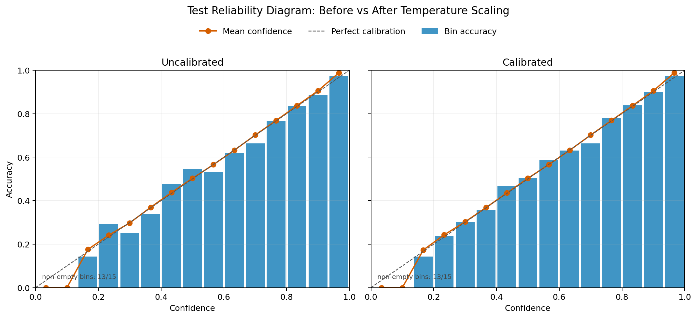
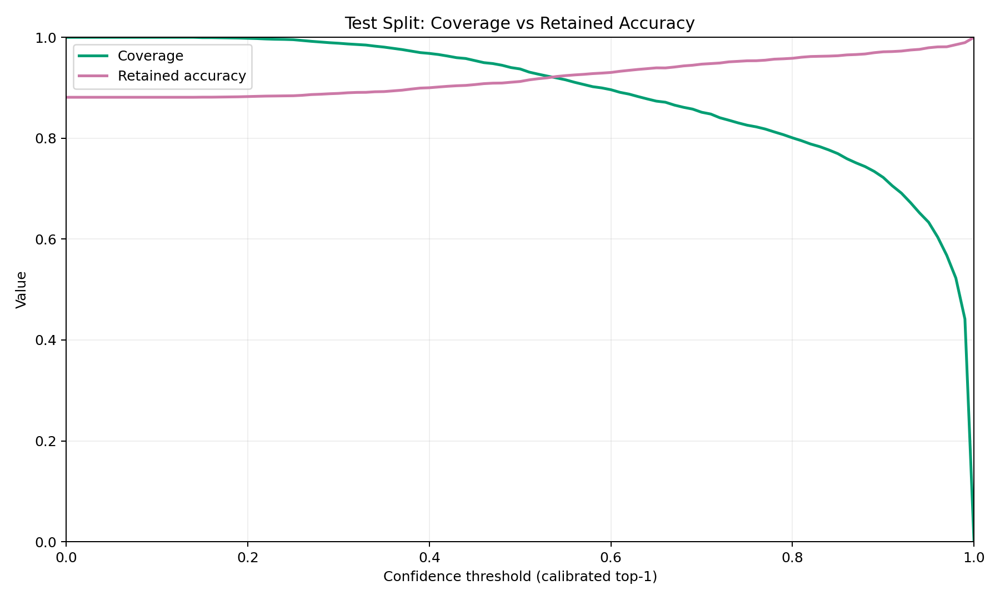

# Calibration Analysis: `exp17_cosine_es_img256_wd1e3_s42`

## Goal
Quantify confidence reliability for the current showcase checkpoint and evaluate a simple post-hoc temperature-scaling calibration path without retraining.

## Scope
- Model checkpoint: `runs/exp17_cosine_es_img256_wd1e3_s42/checkpoints/best.pt`
- Fit split: `val` only
- Report splits: `val`, `test`
- Method: single positive scalar temperature (`T`) fit on validation logits
- Metrics: `ECE`, `NLL` (plus `acc1` sanity check)

Important boundary:
- Temperature is fit on validation only.
- Test metrics are holdout reporting only.

## Result Summary

Learned temperature:
- `T = 1.016617`

Metrics before vs after temperature scaling:

| Split | State | NLL | ECE | acc@1 |
| --- | --- | --- | --- | --- |
| `val` | uncalibrated | `0.291778` | `0.035693` | `0.925272` |
| `val` | calibrated | `0.291688` | `0.040784` | `0.925272` |
| `test` | uncalibrated | `0.429244` | `0.016388` | `0.881167` |
| `test` | calibrated | `0.428342` | `0.012833` | `0.881167` |

Interpretation:
- On the holdout `test` split, calibration improved both `NLL` and `ECE`.
- `acc@1` is unchanged, which is expected for positive scalar temperature scaling (ranking is preserved).
- Fit-split (`val`) `NLL` improved slightly while `ECE` moved slightly worse; this is acceptable because fit optimization targets NLL, and holdout reporting is the primary decision surface.

## Confidence-Threshold Policy View (Test, Calibrated)

Selected points from calibrated top-1 confidence threshold sweep:

| Threshold | Coverage | Retained acc@1 | Retained samples |
| --- | --- | --- | --- |
| `0.50` | `0.937313` | `0.912475` | `3439` |
| `0.70` | `0.851458` | `0.946863` | `3124` |
| `0.90` | `0.722268` | `0.971321` | `2650` |
| `0.95` | `0.633415` | `0.979346` | `2324` |

Interpretation:
- As threshold increases, coverage drops and retained-sample accuracy rises.
- This is an abstain-to-review style tradeoff view, not a threshold optimization project.

## Visual Evidence

### Reliability (`test`): uncalibrated vs calibrated

### Calibrated threshold tradeoff (`test`): coverage vs retained accuracy

## Produced Artifacts

Run-local machine-readable summary:
- `runs/exp17_cosine_es_img256_wd1e3_s42/artifacts/calibration/calibration_summary.json`

Run-local plots:
- `runs/exp17_cosine_es_img256_wd1e3_s42/assets/calibration/reliability_test.png`
- `runs/exp17_cosine_es_img256_wd1e3_s42/assets/calibration/coverage_accuracy_test.png`

Related analysis:
- `docs/experiments/error_analysis_exp17.md`
