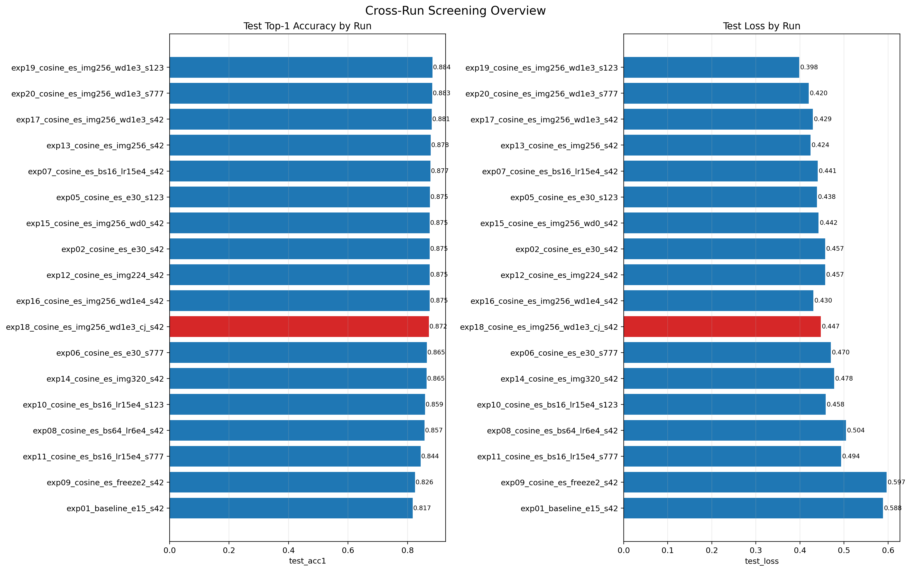
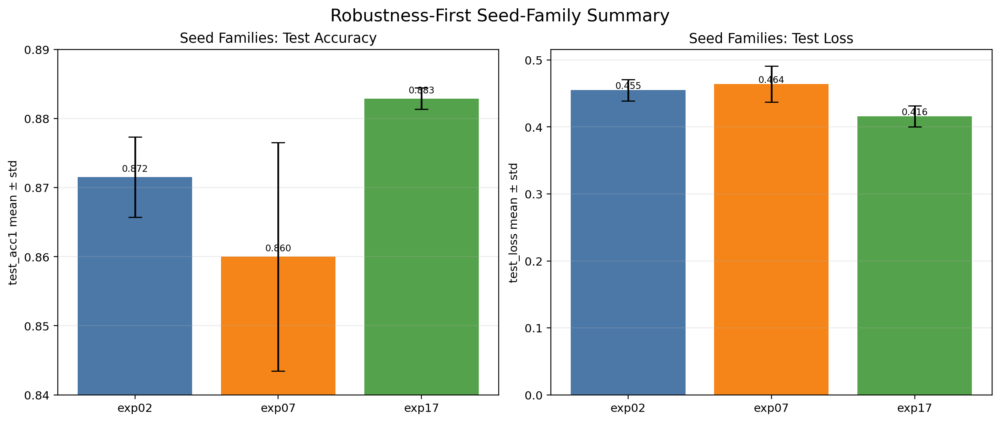

# Cross-Run Experiment Analytics

## Goal

Summarize the committed experiment history as a compact, reviewer-friendly analytics slice built from repo-native configs and run artifacts.

## Coverage

- Total committed runs: `21`
- Runs with retained `val_metrics.json` and `test_metrics.json`: `18`
- Runs with `mlflow_run.json`: `7`
- Missing holdout sidecars: `exp03_plateau_es_e30_s42`, `exp03b_plateau_noes_e30_s42`, `exp04_step_es_e30_s42`

MLflow is used only as optional sidecar metadata. The analytics slice treats configs and run artifacts as the source of truth.

## What Changed

| Run | Change | Val acc@1 | Test acc@1 | Test loss |
| --- | --- | --- | --- | --- |
| `exp12` | `img224` control | `0.914402` | `0.874625` | `0.457049` |
| `exp13` | `img256` | `0.923913` | `0.878168` | `0.424141` |
| `exp14` | `img320` | `0.914402` | `0.864541` | `0.477515` |
| `exp17` | `img256 + wd=1e-3` | `0.925272` | `0.881167` | `0.429245` |
| `exp18` | `img256 + wd=1e-3 + ColorJitter` | `0.908967` | `0.872172` | `0.447445` |

Interpretation:

- `img256` improved over `img224`.
- `img320` regressed and required a smaller batch size.
- `wd=1e-3` was the best single-seed screening candidate.
- mild `ColorJitter` was a clear negative result.

## What Helped Most

| Seed family | Recipe | Test acc@1 mean ± std | Test loss mean ± std |
| --- | --- | --- | --- |
| `exp02` | cosine + early stopping | `0.871536 ± 0.005829` | `0.455129 ± 0.015967` |
| `exp07` | cosine + early stopping, batch=16, lr=1.5e-4 | `0.859998 ± 0.016521` | `0.464114 ± 0.026997` |
| `exp17` | cosine + early stopping, img256, wd=1e-3 | `0.882893 ± 0.001550` | `0.415935 ± 0.015792` |

Interpretation:

- `exp07` looked strong on one seed, but the family mean and spread were weaker.
- `exp17` is the current showcase winner because it combines the best mean quality with the tightest robustness spread.
- The packet keeps single-run screening separate from seed-family conclusions on purpose.

## Notes

- The run-level artifact set stays explicit about missing holdout JSON for `exp03`, `exp03b`, and `exp04`.
- The public output stays compact: two figures and one short report.

## Figures

