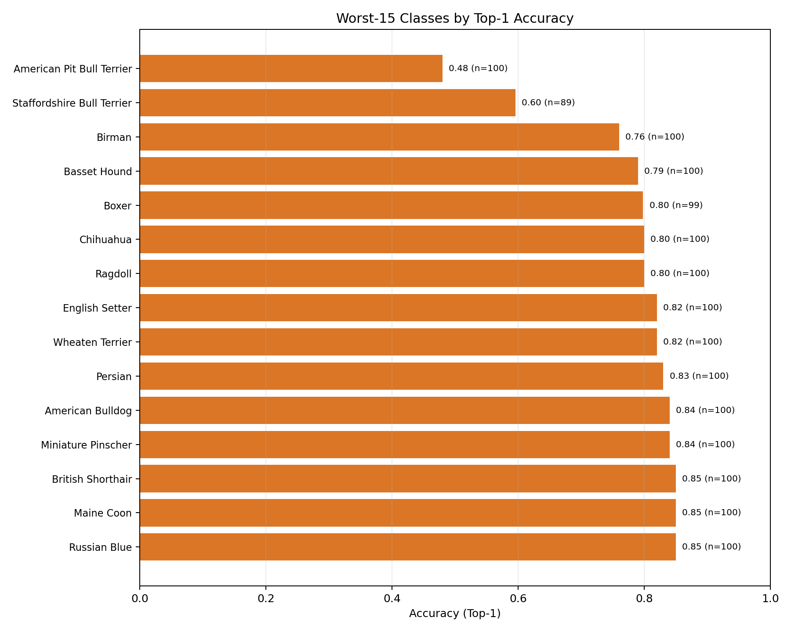
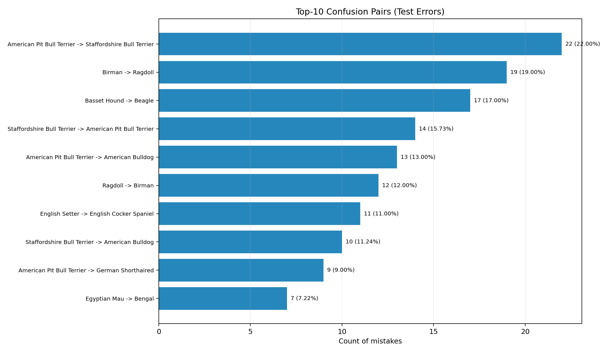
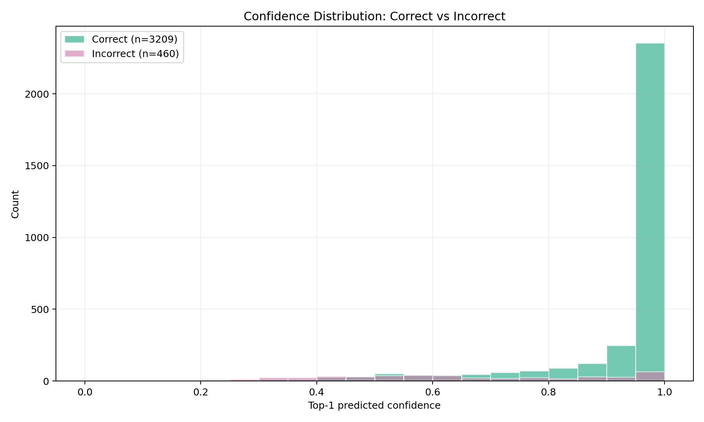
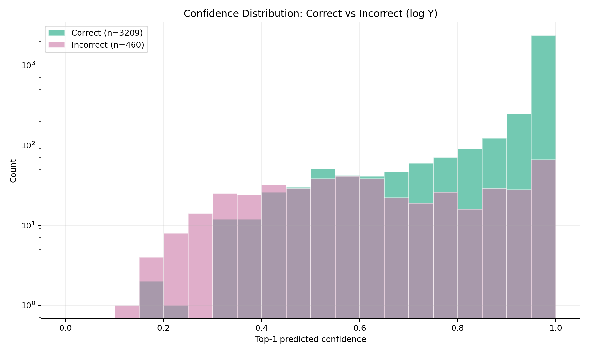

# Error Analysis: `exp02_cosine_es_e30_s42` (test split)

## Goal
Understand **where** the previous showcase model fails (`test_acc1 ~ 0.875`) and what these failures suggest about the next improvements.

## Scope
- Model: `exp02_cosine_es_e30_s42` (previous showcase winner / reference baseline)
- Split: `test`
- Source artifacts:
  - `predictions_test.csv`
  - `per_class_metrics_test.csv`
  - `top_confusions_test.csv`
  - error-analysis plots generated from the CSV files

## High-level summary
- Test set size: `3669`
- Top-1 accuracy: `0.8746`
- Top-5 accuracy: `0.9842`
- Top-1 errors: `460`
- Top-5 rescues among top-1 errors: `402 / 460 = 87.4%`
  - Interpretation: in most mistakes the model is **close** (true class is still in top-5).

## Key findings

### 1) Errors are concentrated in a small set of visually similar breeds

Worst classes by top-1 accuracy (selected):
- `American Pit Bull Terrier`: `acc1=0.48`, `acc5=0.93`
- `Staffordshire Bull Terrier`: `acc1=0.596`, `acc5=0.955`
- `Birman`: `acc1=0.760`, `acc5=0.990`
- `Basset Hound`: `acc1=0.790`, `acc5=0.970`
- `Boxer`: `acc1=0.798`, `acc5=0.980`
- `Ragdoll`: `acc1=0.800`, `acc5=1.000`

This is not random noise: the same classes repeatedly appear among the hardest.

### 2) Confusions are highly structured (not arbitrary)

Top confusion pairs:
- `American Pit Bull Terrier -> Staffordshire Bull Terrier` (`22`, `22.0%` of the class)
- `Birman -> Ragdoll` (`19`, `19.0%`)
- `Basset Hound -> Beagle` (`17`, `17.0%`)
- `Staffordshire Bull Terrier -> American Pit Bull Terrier` (`14`, `15.7%`)
- `American Pit Bull Terrier -> American Bulldog` (`13`, `13.0%`)
- `Ragdoll -> Birman` (`12`, `12.0%`)

Important pattern:
- Many strong confusions are **near-neighbor breeds** (similar morphology/coat/head shape).
- There are also **symmetric confusions** (e.g., `Birman <-> Ragdoll`, `APBT <-> Staffordshire`), which usually means the model feature space separates them poorly rather than one-way bias only.

### 3) Many errors are made with high confidence (overconfident mistakes exist)

Confidence statistics (`pred_confidence`, top-1 predicted class):
- Correct predictions: mean `0.931`, median `0.993`
- Incorrect predictions: mean `0.646`, median `0.622`

So incorrect predictions are less confident on average, **but not always**:
- `20.4%` of top-1 errors have confidence `>= 0.90`
- `14.3%` of top-1 errors have confidence `>= 0.95`
- `6.1%` of top-1 errors have confidence `>= 0.99`

This means:
- confidence is informative,
- but the model is still sometimes **very sure and wrong**.

### 4) Most top-1 errors are “near misses” (true class rank is often 2–5)

Among `460` top-1 errors:
- `402` are recovered by top-5 (`87.4%`)
- only `58` are true top-5 misses

Interpretation:
- The model often recognizes the right semantic neighborhood but ranks the wrong breed first.
- This suggests a **fine-grained separation / ranking problem**, not complete failure of representation.

### 5) A few hard failures look like outliers / strong domain shift / background effects

Examples from top-confidence wrong predictions include unusual mistakes such as:
- `American Bulldog -> Sphynx`
- `American Bulldog -> Saint Bernard`

These likely correspond to difficult shots (pose, scale, lighting, crop, background dominance, or unusual texture cues).
This is exactly why manual inspection of the gallery is useful: some failures are not explained by class similarity alone.

## Visual evidence

### Hardest classes (Top-1)

### Most frequent confusion pairs

### Confidence: correct vs incorrect (linear scale)

### Confidence: correct vs incorrect (log scale)

### Overconfident mistakes gallery

## What this suggests to try next (hypotheses)

### A) Targeted augmentation for fine-grained breeds
Why:
- hardest classes are concentrated in visually similar breeds.

Ideas:
- stronger crop/scale jitter
- color jitter / lighting robustness
- mild random erasing (to reduce overreliance on one patch)

### B) Stronger backbone for fine-grained separation
Why:
- current ResNet18 often gets the right class into top-5 but not top-1.

Ideas:
- ResNet34 / EfficientNet / ConvNeXt-Tiny (one controlled experiment)

### C) Calibration check (later)
Why:
- overconfident errors exist.

Ideas:
- reliability diagram / temperature scaling (nice-to-have)

## Practical conclusion
- `exp02` is a good showcase baseline: robust and well-validated.
- Main weakness is **fine-grained class separation**, especially among similar dog/cat breeds.
- Next high-value improvement direction is **error-driven augmentation + stronger backbone**, not random hyperparameter tuning.
