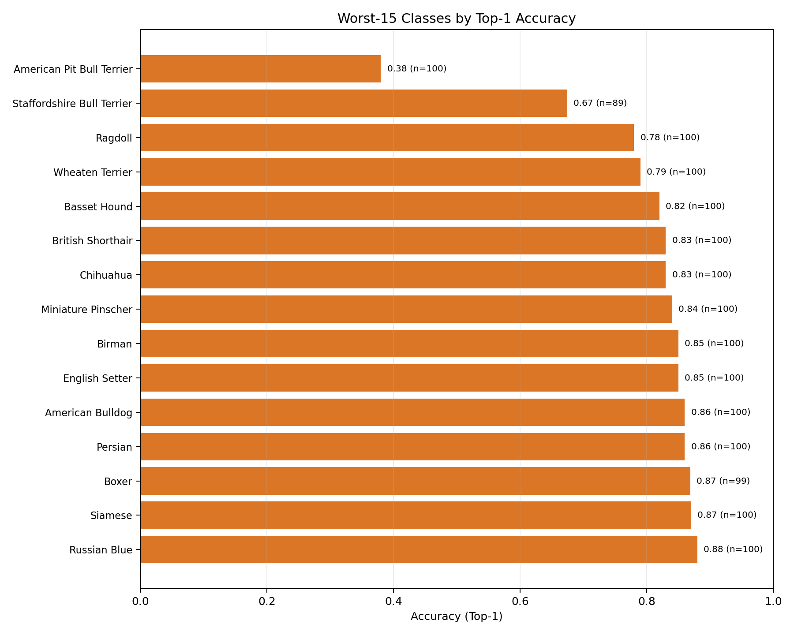
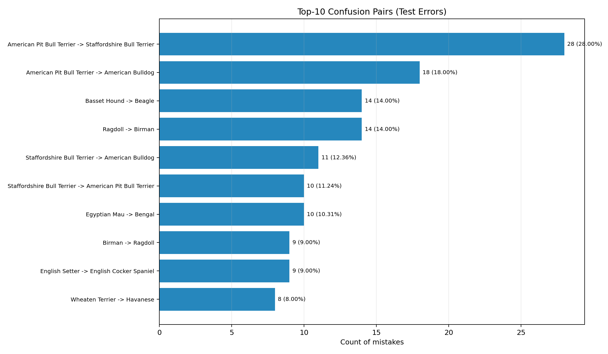
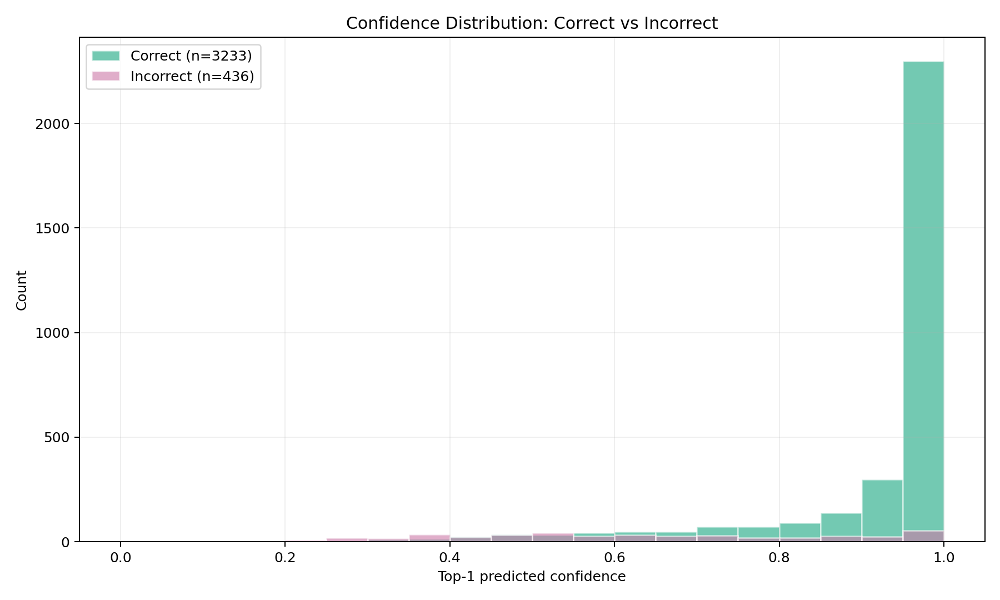
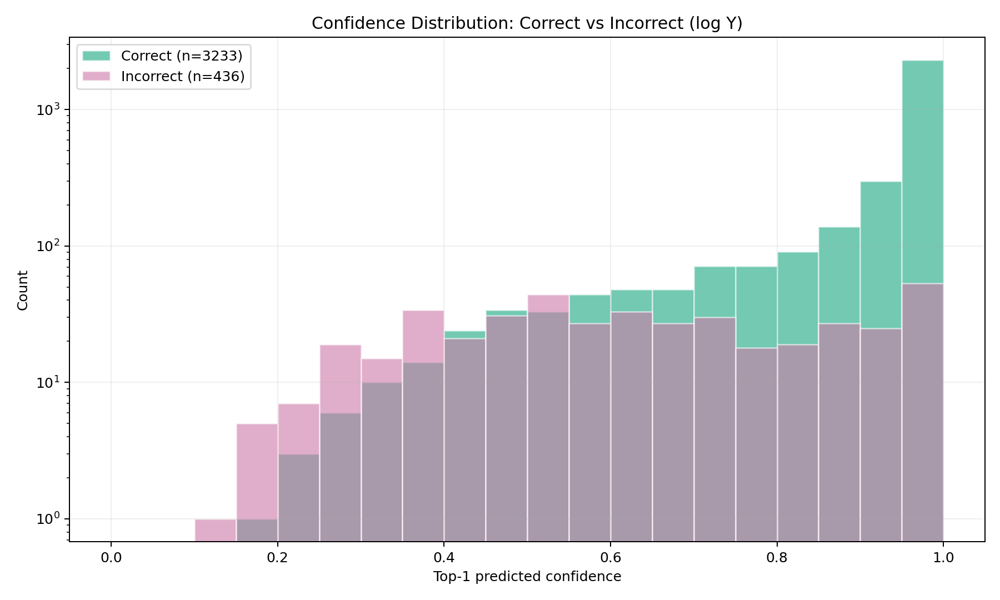

# Error Analysis: `exp17_cosine_es_img256_wd1e3_s42` (test split)

## Goal
Understand **where** the current showcase model fails (`test_acc1 ~ 0.881`) and how the error profile changed vs the previous showcase recipe (`exp02`).

## Scope
- Model: `exp17_cosine_es_img256_wd1e3_s42` (current showcase winner)
- Split: `test`
- Source artifacts:
  - `predictions_test.csv`
  - `per_class_metrics_test.csv`
  - `top_confusions_test.csv`
  - error-analysis plots generated from the CSV files

Reference comparison:
- `docs/experiments/error_analysis_exp02.md` (previous showcase recipe on the same split)

## High-level summary
- Test set size: `3669`
- Top-1 accuracy: `0.8812`
- Top-5 accuracy: `0.9850`
- Top-1 errors: `436`
- Top-5 rescues among top-1 errors: `381 / 436 = 87.4%`
  - Interpretation: the model still often predicts the correct neighborhood but ranks the wrong breed first.

Compared to `exp02` (previous showcase):
- Top-1 errors: `436` vs `460` (`-24`)
- Top-5 rescue rate among top-1 errors: essentially unchanged (`87.4%` vs `87.4%`)
- Net effect: improvement comes mainly from converting some previous top-1 mistakes into top-1 correct predictions

## Key findings

### 1) Errors remain concentrated in a small set of fine-grained breeds

Worst classes by top-1 accuracy (selected):
- `American Pit Bull Terrier`: `acc1=0.380`, `acc5=0.900`
- `Staffordshire Bull Terrier`: `acc1=0.674`, `acc5=0.966`
- `Ragdoll`: `acc1=0.780`, `acc5=0.990`
- `Wheaten Terrier`: `acc1=0.790`, `acc5=0.950`
- `Basset Hound`: `acc1=0.820`, `acc5=0.990`
- `British Shorthair`: `acc1=0.830`, `acc5=0.950`

Interpretation:
- The overall recipe improved average performance, but the task is still dominated by a few hard, visually similar breeds.
- `American Pit Bull Terrier` remains the hardest class and is still a major bottleneck.

### 2) Confusions are still structured and breed-specific

Top confusion pairs:
- `American Pit Bull Terrier -> Staffordshire Bull Terrier` (`28`, `28.0%` of class)
- `American Pit Bull Terrier -> American Bulldog` (`18`, `18.0%`)
- `Basset Hound -> Beagle` (`14`, `14.0%`)
- `Ragdoll -> Birman` (`14`, `14.0%`)
- `Staffordshire Bull Terrier -> American Bulldog` (`11`, `12.4%`)
- `Staffordshire Bull Terrier -> American Pit Bull Terrier` (`10`, `11.2%`)

Pattern:
- The same semantic neighborhoods still dominate (`APBT / Staffordshire / American Bulldog`, `Birman / Ragdoll`, `Basset / Beagle`).
- This remains a **fine-grained separation / ranking** problem, not a representation collapse.

### 3) Some confusions improved substantially, but gains are uneven across classes

Examples of notable improvements vs `exp02`:
- `Birman -> Ragdoll`: `19 -> 9` (large reduction)
- `Staffordshire Bull Terrier` top-1 accuracy: `0.596 -> 0.674`
- `Birman` top-1 accuracy: `0.760 -> 0.850`
- `Boxer` top-1 accuracy: `0.798 -> 0.869`

Examples of regressions / trade-offs:
- `American Pit Bull Terrier` top-1 accuracy: `0.480 -> 0.380`
- `American Pit Bull Terrier -> Staffordshire Bull Terrier`: `22 -> 28`
- `American Pit Bull Terrier -> American Bulldog`: `13 -> 18`

Interpretation:
- The recipe change improved global accuracy, but the gains are not uniform.
- Some difficult fine-grained clusters improved, while the `APBT` cluster remains stubborn (and even worsened in this seed).

### 4) Overconfident mistakes still exist, but their frequency decreased

Confidence statistics (`pred_confidence`, top-1 predicted class):
- Correct predictions: mean `0.928`, median `0.991`
- Incorrect predictions: mean `0.635`, median `0.619`

Overconfident error rates:
- `17.9%` of top-1 errors have confidence `>= 0.90`
- `12.2%` of top-1 errors have confidence `>= 0.95`
- `4.1%` of top-1 errors have confidence `>= 0.99`

Compared to `exp02`:
- `>=0.90`: `17.9%` vs `20.4%`
- `>=0.95`: `12.2%` vs `14.3%`
- `>=0.99`: `4.1%` vs `6.1%`

Interpretation:
- confidence remains informative but imperfect
- the new recipe reduces the frequency of very confident mistakes, which is a positive side effect

### 5) The “near-miss” pattern is still the main story

Among `436` top-1 errors:
- `381` are recovered by top-5 (`87.4%`)
- only `55` are true top-5 misses

Interpretation:
- Most remaining errors are still ranking errors within the correct semantic neighborhood.
- This keeps the next-step priorities unchanged: better fine-grained separation (targeted augmentation, stronger backbone, calibration/interpretability).

## Visual evidence

### Hardest classes (Top-1)

### Most frequent confusion pairs

### Confidence: correct vs incorrect (linear scale)

### Confidence: correct vs incorrect (log scale)

### Overconfident mistakes gallery

## What this suggests to try next (hypotheses)

### A) Refresh analysis-driven augmentation ideas (narrow, not broad)
Why:
- the `ColorJitter` screening recipe was rejected
- remaining errors are concentrated in specific breed clusters

Ideas:
- targeted crop/scale robustness experiments
- mild occlusion (`RandomErasing`) as a separate single-axis test
- class-pair-focused error inspection before adding stronger augmentations

### B) Stronger backbone for fine-grained separation
Why:
- top-5 remains high while top-1 misses persist on neighbor breeds

Ideas:
- one controlled backbone upgrade (`ResNet34`, `ResNet50`, `EfficientNet-B0/B2`)

### C) Confidence calibration / trustworthiness (Group C)
Why:
- overconfident errors decreased but still exist

Ideas:
- reliability diagram
- temperature scaling
- confidence-based abstention analysis (optional)

## Practical conclusion
- `exp17` improves the previous showcase recipe on both average quality and seed robustness.
- The error profile still confirms the same core bottleneck: **fine-grained class separation**, especially in a few hard breed clusters.
- The most portfolio-valuable next step is to pair this stronger recipe with **updated interpretability/calibration analysis** (and optionally a controlled backbone upgrade next).
