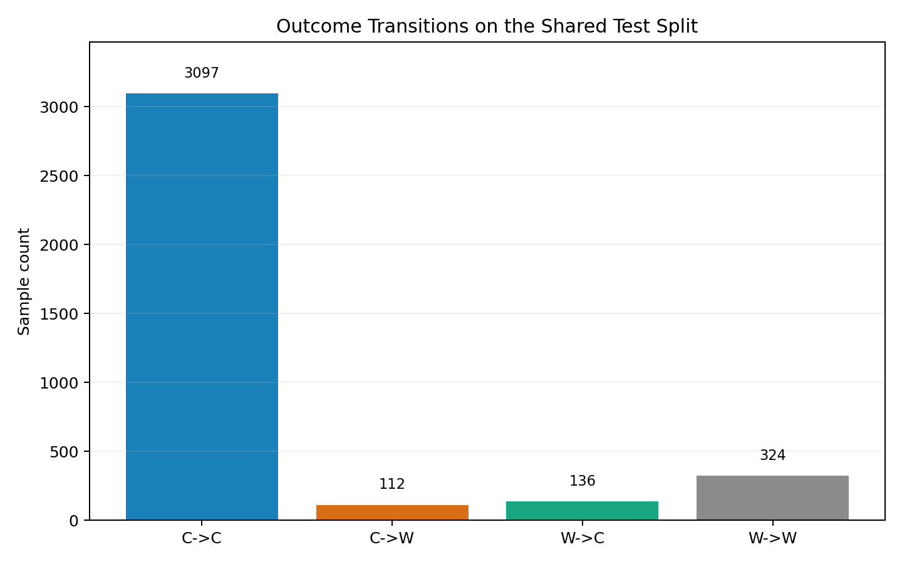
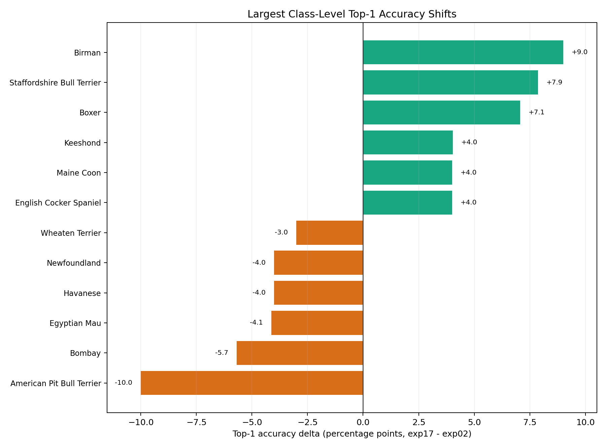
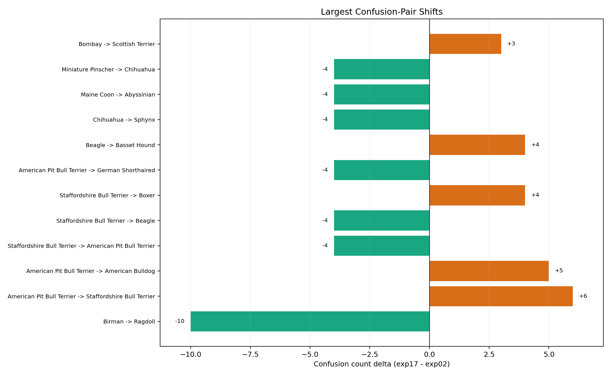

# Error-Delta Report: `exp17` vs `exp02` (test split)

## Goal

Show the before/after error delta between the previous showcase recipe (`exp02_cosine_es_e30_s42`) and the current showcase recipe (`exp17_cosine_es_img256_wd1e3_s42`) on the same committed `test` split.

This note stays narrow on one question: where did the newer recipe actually fix mistakes, and where did it regress?

## Scope

- Baseline:
  - `exp02_cosine_es_e30_s42`
- Candidate:
  - `exp17_cosine_es_img256_wd1e3_s42`
- Split:
  - `test`
- Inputs:
  - committed error-analysis exports only (`predictions_test.csv`, `per_class_metrics_test.csv`, `top_confusions_test.csv`, `summary_test.json`)

Reference context:

- [Previous showcase error analysis (`exp02`)](error_analysis_exp02.md)
- [Current showcase error analysis (`exp17`)](error_analysis_exp17.md)
- [Cross-run experiment analytics](cross_run_analytics.md)

## Headline Comparison

| Run | Top-1 acc | Top-5 acc | Top-1 errors | Top-5 rescues among top-1 errors |
| --- | --- | --- | --- | --- |
| `exp02` | `0.8746` | `0.9842` | `460` | `402 / 460 = 87.4%` |
| `exp17` | `0.8812` | `0.9850` | `436` | `381 / 436 = 87.4%` |

Interpretation:

- `exp17` removes `24` top-1 mistakes overall.
- The top-5 rescue rate among top-1 errors is essentially unchanged.
- This means the gain is mostly about converting some existing near-misses into top-1 correct predictions, not about changing the semantic neighborhood story.

## Sample-Level Outcome Shifts

Exact sample transitions on the shared split:

- `C -> C`: `3097`
- `W -> C`: `136`
- `C -> W`: `112`
- `W -> W`: `324`

Net effect:

- `136` previous mistakes were fixed
- `112` previously correct samples regressed
- improvement is real, but it is not uniform

The visual summary makes that trade-off easy to scan:



## Where The Recipe Helped Most

Strongest class-level top-1 gains:

- `Birman`: `0.760 -> 0.850` (`+9.0` percentage points)
- `Staffordshire Bull Terrier`: `0.596 -> 0.674` (`+7.9` points)
- `Boxer`: `0.798 -> 0.869` (`+7.1` points)

Broad pattern:

- `19` classes improved
- `15` classes regressed
- `3` classes were unchanged

This is a net-positive update, but it is clearly an uneven one rather than a uniform lift across all breeds.



## Where The Recipe Regressed

The main regression remains the `American Pit Bull Terrier` cluster:

- `American Pit Bull Terrier` top-1 accuracy: `0.480 -> 0.380`
- `American Pit Bull Terrier -> Staffordshire Bull Terrier`: `22 -> 28`
- `American Pit Bull Terrier -> American Bulldog`: `13 -> 18`

There are also smaller class-level regressions in breeds such as `Bombay` and `Egyptian Mau`, but the APBT neighborhood is still the clearest unresolved bottleneck.

## Confusion-Pair Delta

Largest confusion reduction:

- `Birman -> Ragdoll`: `19 -> 9`

Largest confusion increases:

- `American Pit Bull Terrier -> Staffordshire Bull Terrier`: `22 -> 28`
- `American Pit Bull Terrier -> American Bulldog`: `13 -> 18`
- `Beagle -> Basset Hound`: `2 -> 6`

Interpretation:

- the newer recipe does reduce some high-volume fine-grained confusions
- the same semantic neighborhoods still dominate the remaining errors:
  - `American Pit Bull Terrier / Staffordshire Bull Terrier / American Bulldog`
  - `Birman / Ragdoll`
  - `Basset Hound / Beagle`



## Secondary Observations

- Top-5 change stayed small:
  - full-split `acc@5` moved only from `0.9842` to `0.9850`
  - among shared samples, `24` cases moved from top-5 miss to top-5 hit, while `21` moved the other way
- Very high-confidence mistakes decreased:
  - `>= 0.90`: `94 -> 78`
  - `>= 0.95`: `66 -> 53`
  - `>= 0.99`: `28 -> 18`
- Among the `324` persistent errors, the true-class rank improved more often than it worsened (`93` improved vs `85` worsened), which again points to a ranking problem more than a representation collapse.

## Practical Conclusion

- `exp17` is a meaningful improvement over `exp02`, but the gain is compact rather than dramatic.
- The strongest evidence is the sample-level transition view: more mistakes were fixed than introduced (`136` vs `112`).
- The bottleneck remains the same: fine-grained breed separation and ranking inside a few hard neighborhoods.
- That keeps the repo narrative consistent with the broader experiment history:
  - the controlled `img256 + wd=1e-3` recipe helped
  - it did not fundamentally change the hardest breed clusters

## Reproduction

```bash
python -m src.error_delta \
  --baseline-dir runs/exp02_cosine_es_e30_s42/artifacts/error_analysis \
  --candidate-dir runs/exp17_cosine_es_img256_wd1e3_s42/artifacts/error_analysis \
  --out-dir artifacts/error_delta/exp17_vs_exp02 \
  --public-assets-dir docs/experiments/assets \
  --public-prefix exp17_vs_exp02
```
