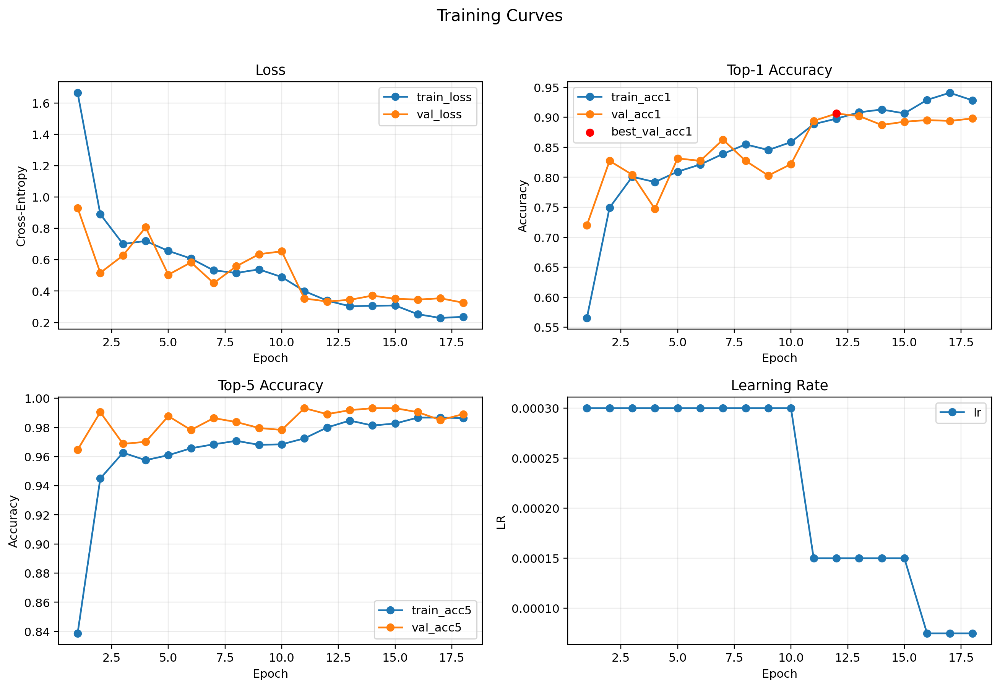
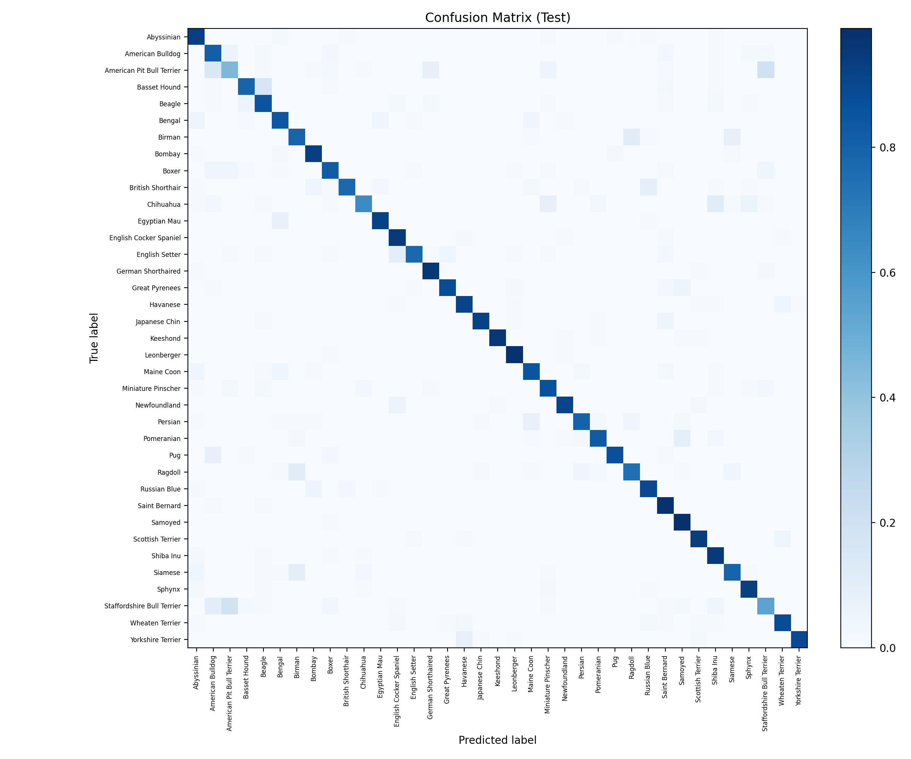

# Experiment: `exp03_plateau_es_e30_s42`

## Goal
Compare adaptive LR reduction (`ReduceLROnPlateau`) against cosine schedule, with the same early stopping policy.

## Config
- Path: `configs/experiments/exp03_plateau_es_e30_s42.yaml`
- Scheduler: `plateau` (`monitor=val_loss`, `mode=min`, `factor=0.5`, `patience=2`, `min_lr=1e-6`)
- Early stopping: `enabled` (`monitor=val_acc1`, `mode=max`, `patience=6`, `min_delta=0.001`)

## Commands
```bash
source .venv/bin/activate
./scripts/run_experiment.sh configs/experiments/exp03_plateau_es_e30_s42.yaml runs/exp03_plateau_es_e30_s42
```

If you intentionally rerun into the same folder:

```bash
./scripts/run_experiment.sh --force configs/experiments/exp03_plateau_es_e30_s42.yaml runs/exp03_plateau_es_e30_s42
```

## Outputs
- Checkpoint: `runs/exp03_plateau_es_e30_s42/checkpoints/best.pt`
- Metrics CSV: `runs/exp03_plateau_es_e30_s42/artifacts/metrics.csv`
- Curves: `runs/exp03_plateau_es_e30_s42/assets/training_curves.png`
- Confusion matrix: `runs/exp03_plateau_es_e30_s42/assets/confusion_matrix.png`

## Results
- Best epoch: 12
- Early-stopped epoch: 18
- Val: `loss 0.3341 | acc@1 0.906 | acc@5 0.989`
- Test: `loss 0.4906 | acc@1 0.852 | acc@5 0.982`

## Visuals




## Notes
- Compare this run with `docs/experiments/exp02_cosine_es_e30_s42.md`.
- Plateau with early stopping underperforms cosine on both val and test metrics.
