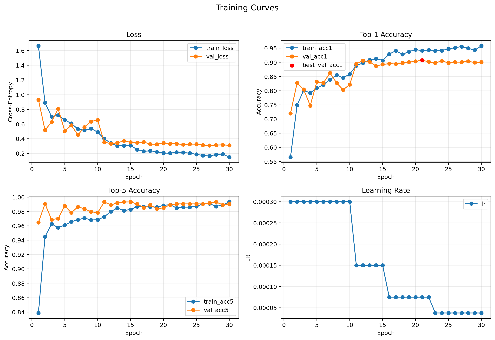
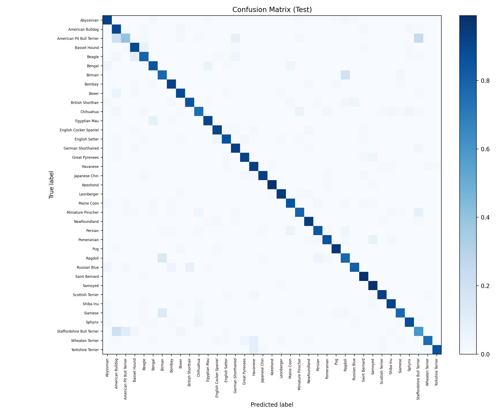

# Experiment: `exp03b_plateau_noes_e30_s42`

## Goal
Control run for plateau scheduler without early stopping to verify whether ES was cutting off late gains.

## Config
- Path: `configs/experiments/exp03b_plateau_noes_e30_s42.yaml`
- Scheduler: `plateau` (`monitor=val_loss`, `mode=min`, `factor=0.5`, `patience=2`, `min_lr=1e-6`)
- Early stopping: `disabled`

## Commands
```bash
source .venv/bin/activate
./scripts/run_experiment.sh configs/experiments/exp03b_plateau_noes_e30_s42.yaml runs/exp03b_plateau_noes_e30_s42
```

If you intentionally rerun into the same folder:

```bash
./scripts/run_experiment.sh --force configs/experiments/exp03b_plateau_noes_e30_s42.yaml runs/exp03b_plateau_noes_e30_s42
```

## Outputs
- Checkpoint: `runs/exp03b_plateau_noes_e30_s42/checkpoints/best.pt`
- Metrics CSV: `runs/exp03b_plateau_noes_e30_s42/artifacts/metrics.csv`
- Curves: `runs/exp03b_plateau_noes_e30_s42/assets/training_curves.png`
- Confusion matrix: `runs/exp03b_plateau_noes_e30_s42/assets/confusion_matrix.png`

## Results
- Best epoch: 21
- Stopped epoch: 30 (max epochs)
- Val: `loss 0.3322 | acc@1 0.908 | acc@5 0.989`
- Test: `loss 0.4864 | acc@1 0.859 | acc@5 0.981`

## Visuals




## Notes
- Disabling ES improves plateau slightly vs `exp03` (`0.852 -> 0.859` test acc@1), but still below cosine (`0.875`).
