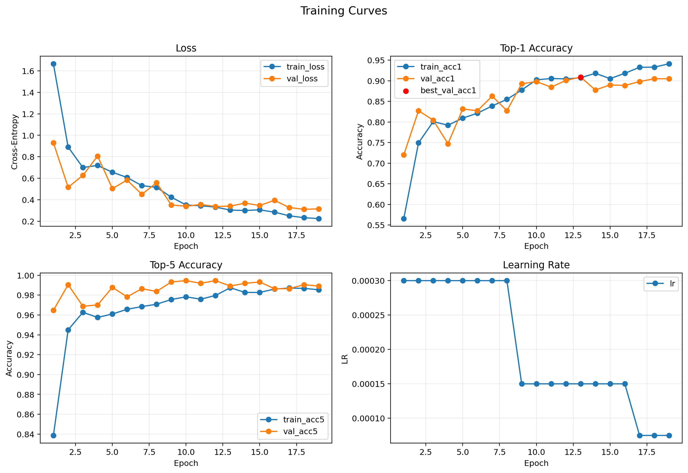
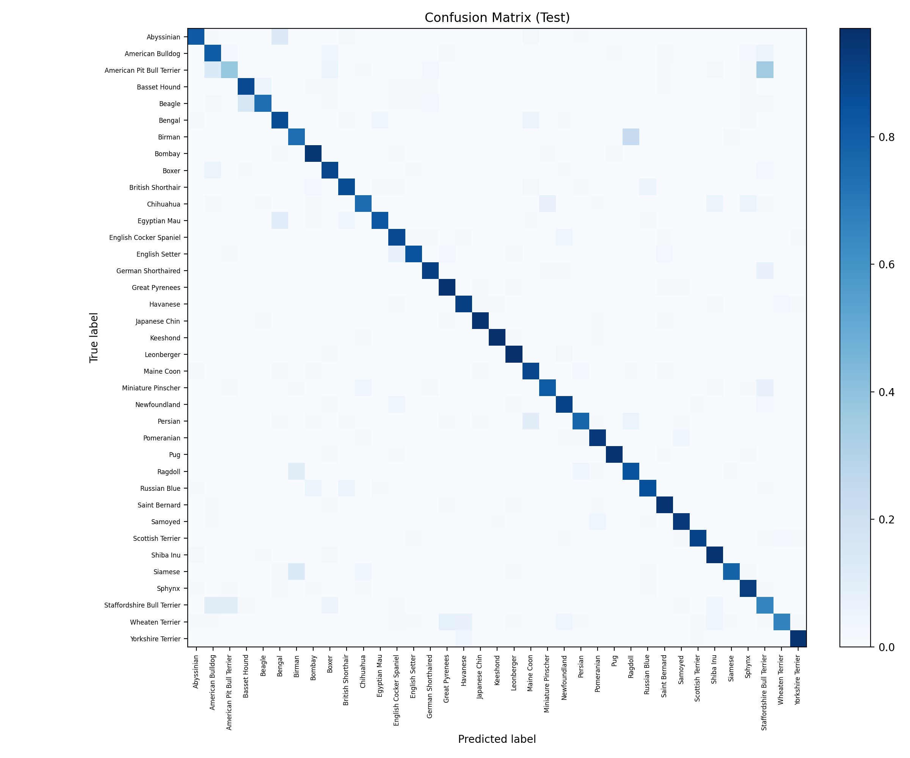

# Experiment: `exp04_step_es_e30_s42`

## Goal
Compare `StepLR` against cosine and plateau under the same early stopping policy.

## Config
- Path: `configs/experiments/exp04_step_es_e30_s42.yaml`
- Scheduler: `step` (`step_size=8`, `gamma=0.5`)
- Early stopping: `enabled` (`monitor=val_acc1`, `mode=max`, `patience=6`, `min_delta=0.001`)

## Commands
```bash
source .venv/bin/activate
./scripts/run_experiment.sh configs/experiments/exp04_step_es_e30_s42.yaml runs/exp04_step_es_e30_s42
```

If you intentionally rerun into the same folder:

```bash
./scripts/run_experiment.sh --force configs/experiments/exp04_step_es_e30_s42.yaml runs/exp04_step_es_e30_s42
```

## Outputs
- Checkpoint: `runs/exp04_step_es_e30_s42/checkpoints/best.pt`
- Metrics CSV: `runs/exp04_step_es_e30_s42/artifacts/metrics.csv`
- Curves: `runs/exp04_step_es_e30_s42/assets/training_curves.png`
- Confusion matrix: `runs/exp04_step_es_e30_s42/assets/confusion_matrix.png`

## Results
- Best epoch: 13
- Early-stopped epoch: 19
- Val: `loss 0.3416 | acc@1 0.909 | acc@5 0.989`
- Test: `loss 0.4977 | acc@1 0.851 | acc@5 0.982`

## Visuals




## Notes
- Compare with `exp02` and `exp03b` by test acc@1 and test loss.
- StepLR improves over baseline but remains below cosine on test metrics.
