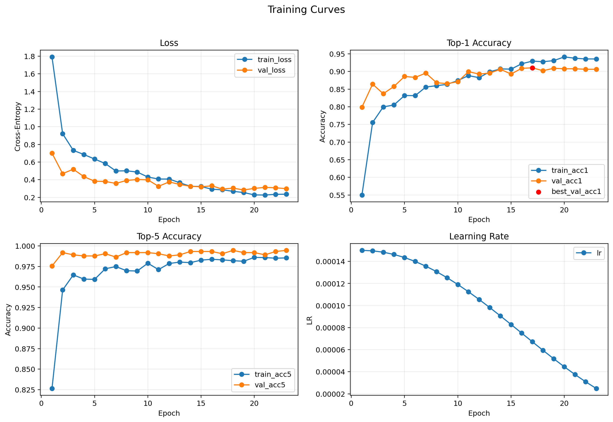
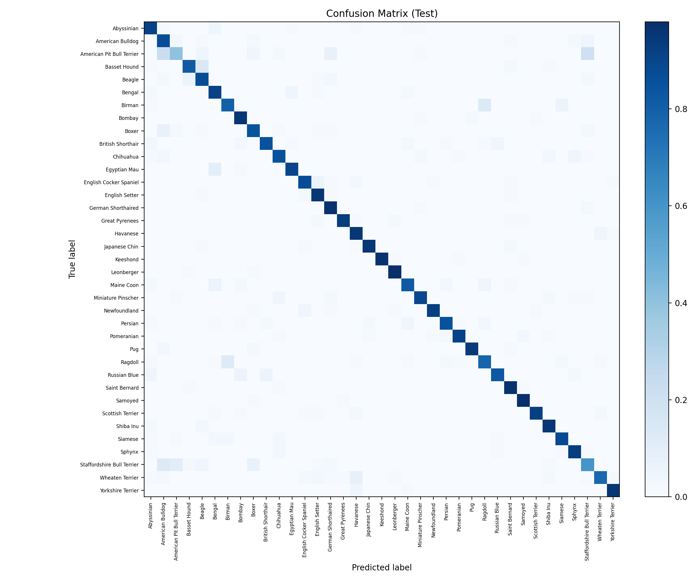

# Experiment: `exp07_cosine_es_bs16_lr15e4_s42`

## Goal
Check whether a smaller batch (`16`) with scaled LR (`1.5e-4`) improves generalization for the cosine winner.

## Config
- Path: `configs/experiments/exp07_cosine_es_bs16_lr15e4_s42.yaml`
- Scheduler: `cosine` (`t_max=30`)
- Early stopping: `enabled` (`monitor=val_acc1`, `patience=6`)
- Batch/LR: `batch_size=16`, `lr=1.5e-4`

## Commands
```bash
source .venv/bin/activate
./scripts/run_experiment.sh configs/experiments/exp07_cosine_es_bs16_lr15e4_s42.yaml runs/exp07_cosine_es_bs16_lr15e4_s42
```

## Outputs
- Checkpoint: `runs/exp07_cosine_es_bs16_lr15e4_s42/checkpoints/best.pt`
- Metrics CSV: `runs/exp07_cosine_es_bs16_lr15e4_s42/artifacts/metrics.csv`
- Curves: `runs/exp07_cosine_es_bs16_lr15e4_s42/assets/training_curves.png`
- Confusion matrix: `runs/exp07_cosine_es_bs16_lr15e4_s42/assets/confusion_matrix.png`

## Results
- Best epoch: 17
- Early-stopped epoch: 23
- Val: `loss 0.2934 | acc@1 0.910 | acc@5 0.990`
- Test: `loss 0.4405 | acc@1 0.877 | acc@5 0.983`

## Visuals




## Notes
- Compare with `exp02` and `exp08`.
- Best single-seed test accuracy so far (`0.877`) among tried configs.
