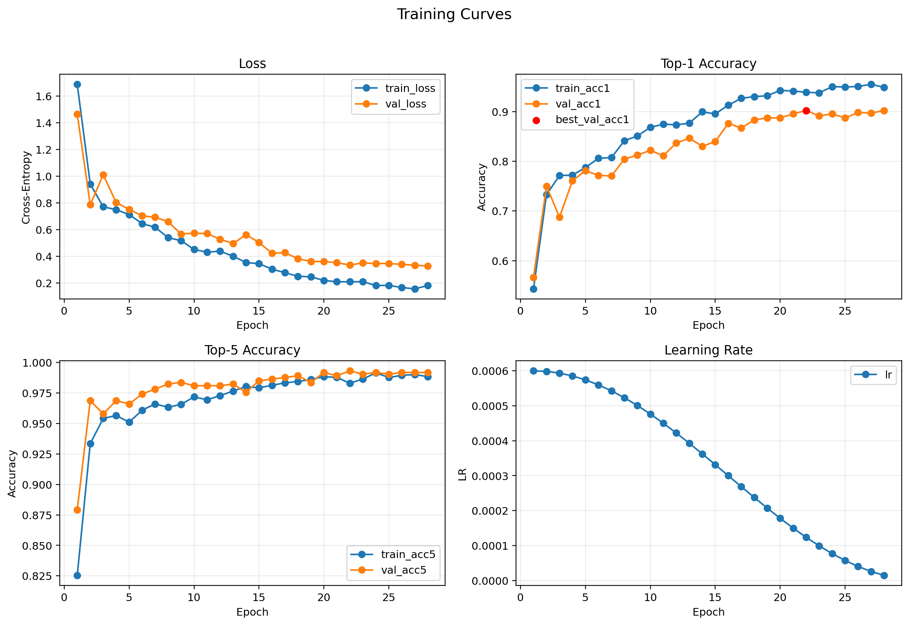
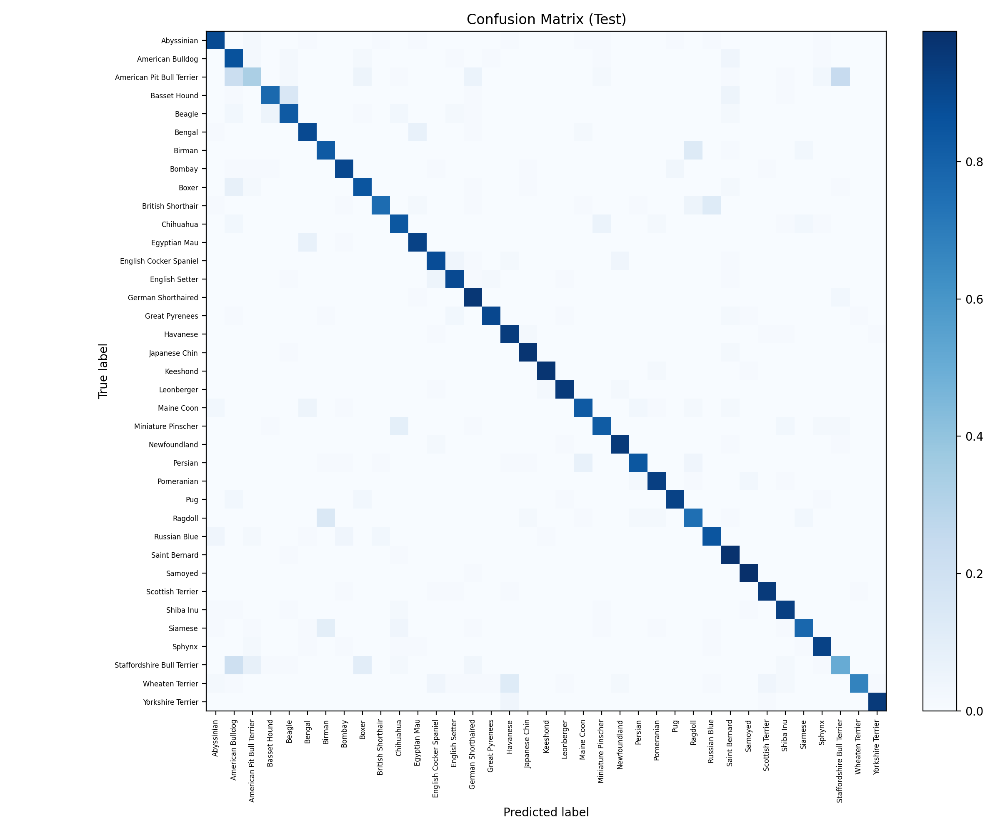

# Experiment: `exp08_cosine_es_bs64_lr6e4_s42`

## Goal
Check whether a larger batch (`64`) with scaled LR (`6e-4`) improves speed/quality for the cosine winner.

## Config
- Path: `configs/experiments/exp08_cosine_es_bs64_lr6e4_s42.yaml`
- Scheduler: `cosine` (`t_max=30`)
- Early stopping: `enabled` (`monitor=val_acc1`, `patience=6`)
- Batch/LR: `batch_size=64`, `lr=6e-4`

## Commands
```bash
source .venv/bin/activate
./scripts/run_experiment.sh configs/experiments/exp08_cosine_es_bs64_lr6e4_s42.yaml runs/exp08_cosine_es_bs64_lr6e4_s42
```

## Outputs
- Checkpoint: `runs/exp08_cosine_es_bs64_lr6e4_s42/checkpoints/best.pt`
- Metrics CSV: `runs/exp08_cosine_es_bs64_lr6e4_s42/artifacts/metrics.csv`
- Curves: `runs/exp08_cosine_es_bs64_lr6e4_s42/assets/training_curves.png`
- Confusion matrix: `runs/exp08_cosine_es_bs64_lr6e4_s42/assets/confusion_matrix.png`

## Results
- Best epoch: 22
- Early-stopped epoch: 28
- Val: `loss 0.3335 | acc@1 0.902 | acc@5 0.993`
- Test: `loss 0.5044 | acc@1 0.857 | acc@5 0.978`

## Visuals




## Notes
- Compare with `exp02` and `exp07`.
- Larger batch with scaled LR underperforms the default batch size setup.
