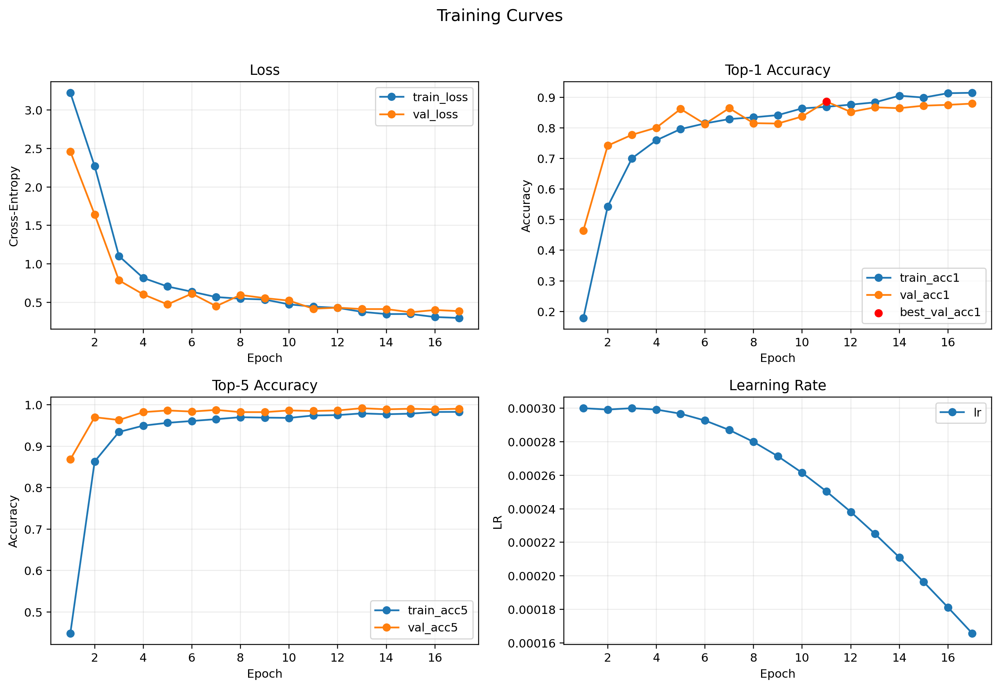
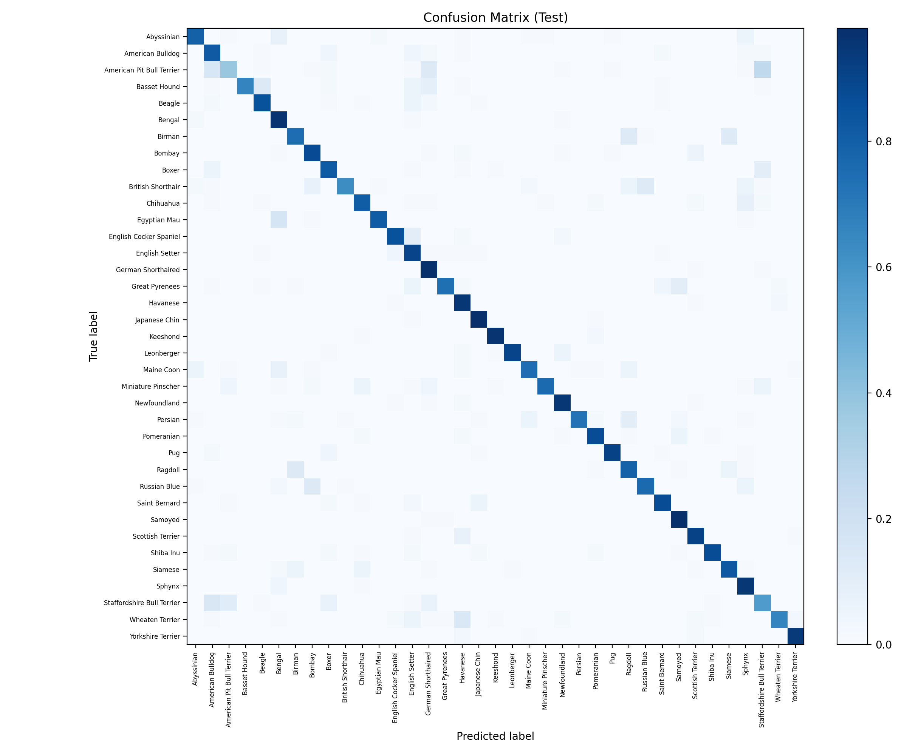

# Experiment: `exp09_cosine_es_freeze2_s42`

## Goal
Check whether freezing the backbone for first 2 epochs improves stability and final quality.

## Config
- Path: `configs/experiments/exp09_cosine_es_freeze2_s42.yaml`
- Scheduler: `cosine` (`t_max=30`)
- Early stopping: `enabled` (`monitor=val_acc1`, `patience=6`)
- Freeze strategy: `freeze_backbone=true`, `freeze_epochs=2`

## Commands
```bash
source .venv/bin/activate
./scripts/run_experiment.sh configs/experiments/exp09_cosine_es_freeze2_s42.yaml runs/exp09_cosine_es_freeze2_s42
```

## Outputs
- Checkpoint: `runs/exp09_cosine_es_freeze2_s42/checkpoints/best.pt`
- Metrics CSV: `runs/exp09_cosine_es_freeze2_s42/artifacts/metrics.csv`
- Curves: `runs/exp09_cosine_es_freeze2_s42/assets/training_curves.png`
- Confusion matrix: `runs/exp09_cosine_es_freeze2_s42/assets/confusion_matrix.png`

## Results
- Best epoch: 11
- Early-stopped epoch: 17
- Val: `loss 0.4156 | acc@1 0.886 | acc@5 0.985`
- Test: `loss 0.5968 | acc@1 0.826 | acc@5 0.974`

## Visuals




## Notes
- Compare with `exp02` (same batch/lr but without freezing).
- Freezing backbone for 2 epochs hurts quality for this dataset/setup.
