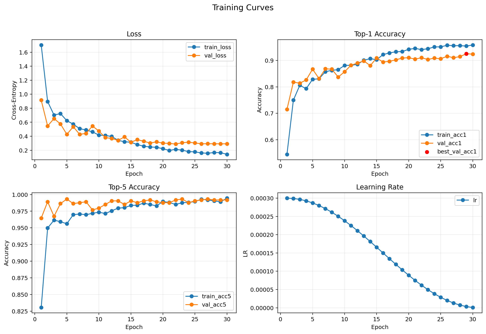
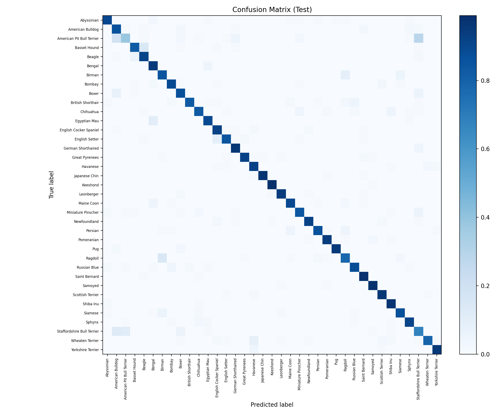

# Experiment: `exp17_cosine_es_img256_wd1e3_s42`

## Goal
Test the best single-seed candidate from Group A-short screening:
- increased input resolution (`image_size=256`, `eval_resize_size=292`)
- `AdamW weight_decay=1e-3`
- keep the rest of the recipe aligned with the cosine + early stopping setup

## Config
- Path: `configs/experiments/exp17_cosine_es_img256_wd1e3_s42.yaml`
- Image transforms:
  - Train: `RandomResizedCrop(256)` + flip
  - Eval/Test: `Resize(292) -> CenterCrop(256)`
- Optimizer regularization: `weight_decay=1e-3`
- Scheduler: `cosine` (`t_max=30`)
- Early stopping: `enabled` (`monitor=val_acc1`, `mode=max`, `patience=6`, `min_delta=0.001`)

## Commands
```bash
source .venv/bin/activate
./scripts/run_experiment.sh configs/experiments/exp17_cosine_es_img256_wd1e3_s42.yaml runs/exp17_cosine_es_img256_wd1e3_s42
```

If you intentionally rerun into the same folder:

```bash
./scripts/run_experiment.sh --force configs/experiments/exp17_cosine_es_img256_wd1e3_s42.yaml runs/exp17_cosine_es_img256_wd1e3_s42
```

## Outputs
- Checkpoint: `runs/exp17_cosine_es_img256_wd1e3_s42/checkpoints/best.pt`
- Metrics CSV: `runs/exp17_cosine_es_img256_wd1e3_s42/artifacts/metrics.csv`
- Curves: `runs/exp17_cosine_es_img256_wd1e3_s42/assets/training_curves.png`
- Confusion matrix: `runs/exp17_cosine_es_img256_wd1e3_s42/assets/confusion_matrix.png`

## Results
- Best epoch: 29
- Stopped at epoch: 30 (no early stop)
- Val: `loss 0.2918 | acc@1 0.925 | acc@5 0.992`
- Test: `loss 0.4292 | acc@1 0.881 | acc@5 0.985`

## Visuals




## Notes
- This run was selected as the **Group A-short candidate** for robustness follow-up.
- Single-seed improvement vs the previous cosine showcase seed (`exp02`, seed 42):
  - `test_acc1`: `0.881` vs `0.875` (`+0.6 pp`)
  - `test_loss`: `0.429` vs `0.457`
- See the full screening summary in `docs/experiments/group_a_short_resolution_wd_aug.md`.
- Final showcase decision is based on the 3-seed sweep in `docs/experiments/seed_sweep_img256_wd1e3.md`.
