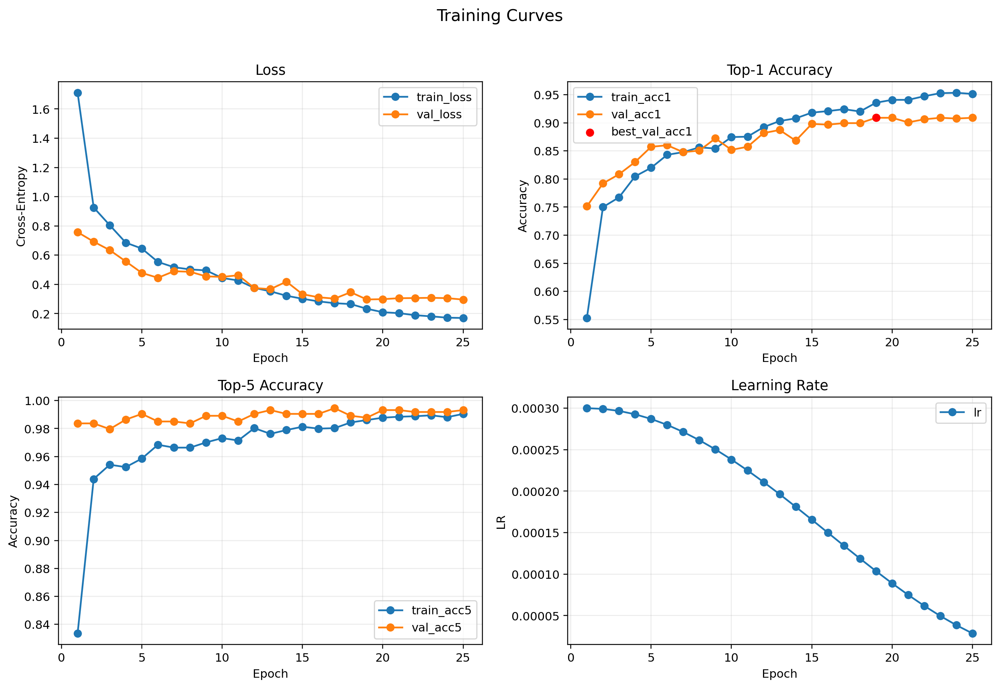
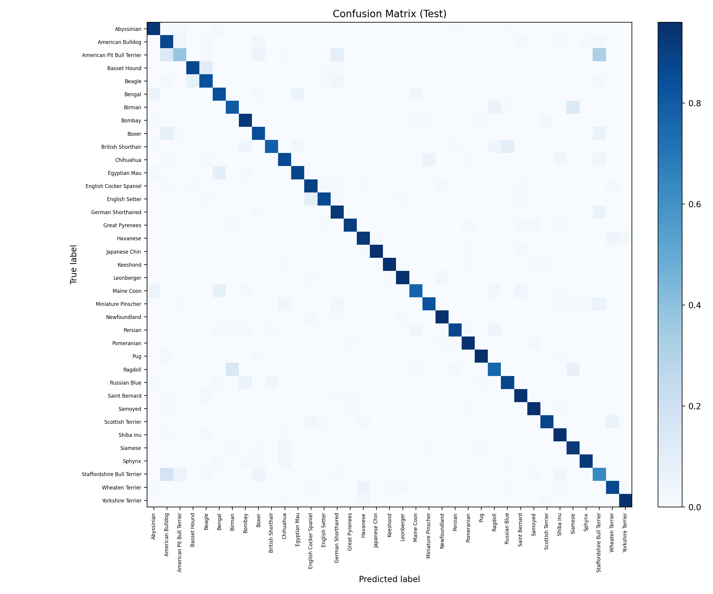

# Experiment: `exp18_cosine_es_img256_wd1e3_cj_s42`

## Goal
Test exactly one additional augmentation recipe in Group A-short:
- start from the best screening candidate (`img256` + `weight_decay=1e-3`)
- add mild `ColorJitter`
- keep the rest of the recipe unchanged

This is a **single-axis augmentation test** and is documented as a negative result.

## Config
- Path: `configs/experiments/exp18_cosine_es_img256_wd1e3_cj_s42.yaml`
- Base recipe: `exp17` (`image_size=256`, `eval_resize_size=292`, `weight_decay=1e-3`)
- Extra train augmentation:
  - `ColorJitter(enabled=true, brightness=0.15, contrast=0.15, saturation=0.15, hue=0.0)`
- Scheduler: `cosine` (`t_max=30`)
- Early stopping: `enabled` (`monitor=val_acc1`, `mode=max`, `patience=6`, `min_delta=0.001`)

## Commands
```bash
source .venv/bin/activate
./scripts/run_experiment.sh configs/experiments/exp18_cosine_es_img256_wd1e3_cj_s42.yaml runs/exp18_cosine_es_img256_wd1e3_cj_s42
```

If you intentionally rerun into the same folder:

```bash
./scripts/run_experiment.sh --force configs/experiments/exp18_cosine_es_img256_wd1e3_cj_s42.yaml runs/exp18_cosine_es_img256_wd1e3_cj_s42
```

## Outputs
- Checkpoint: `runs/exp18_cosine_es_img256_wd1e3_cj_s42/checkpoints/best.pt`
- Metrics CSV: `runs/exp18_cosine_es_img256_wd1e3_cj_s42/artifacts/metrics.csv`
- Curves: `runs/exp18_cosine_es_img256_wd1e3_cj_s42/assets/training_curves.png`
- Confusion matrix: `runs/exp18_cosine_es_img256_wd1e3_cj_s42/assets/confusion_matrix.png`

## Results
- Best epoch: 19
- Early-stopped epoch: 25
- Val: `loss 0.2969 | acc@1 0.909 | acc@5 0.988`
- Test: `loss 0.4474 | acc@1 0.872 | acc@5 0.984`

## Visuals




## Notes
- Compared to the base candidate `exp17` (same resolution + `wd=1e-3`, no extra augmentation):
  - `val_acc1`: `0.909` vs `0.925` (worse)
  - `test_acc1`: `0.872` vs `0.881` (worse)
  - `test_loss`: `0.447` vs `0.429` (worse)
- Decision: **reject this `ColorJitter` recipe** for the current ResNet18 pipeline.
- Portfolio value: this is a useful negative result showing disciplined, hypothesis-driven augmentation testing (single-axis change, explicit keep/reject decision).
- See the grouped summary in `docs/experiments/group_a_short_resolution_wd_aug.md`.
